<div align="center">

  <h1 style="font-size: larger;">
  <strong> Workshop de Cero a Héroe: Layer 2 en Español-SEED Latam-StarknetEs </strong> 
  </h1>
    
    
    
    <br/><br/>
    
<a href="https://github.com/Starknet-Es">

<a href="">

</a>
</a>
<a href="https://twitter.com/StarkNetEs">

</a>
<a href="">

</a>
<a href="https://twitter.com/Nadai02010">

</a>
<a href="https://github.com/Nadai2010/Nadai-Workshop-DefiLab-StarknetEs">

</a>

</div>

## Recursos oficiales

- [Starknet Doc](https://docs.starknet.io/documentation/) - Documentos oficiales de Starknet
- [Starknet Book](https://book.starknet.io/) - Libro de Starknet
- [Cairo Doc](https://www.cairo-lang.org/docs/) - Documentos oficiales de de Cairo
- [Libro Cairo](https://cairo-book.github.io/) - Libro de Cairo
- [Sintaxis Cairo by Nethermind](https://github.com/NethermindEth/CairoByExample/)  |   [Sintaxis Cairo by LambdaClass](https://github.com/lambdaclass/cairo-by-example/)


---

## Temas 

- [Pre-requisitos](#pre-requisitos)
 - [Git](#git)
 - [Curl](#curl)
- [Instalación de Starkli](#instalación-de-starkli)
- [Instalación de Scarb](#instalación-de-scarb)
- [Cuentas y Firmantes](#cuenta-y-firmantes)
    - [Crear Cuenta con Starkli (Opción A)](#crear-cuenta-con-starkli-opción-a)      
      - [Conseguir Faucet](#conseguir-faucet)
      - [Configuración de Variables de Entorno A](#configuración-de-variables-de-entorno-a)
      - [Desplegar Contrato de Cuenta A](#desplegar-contrato-de-cuenta-a)
    - [Crear Cuenta ArgentX o Braavos (Opción B)](#crear-cuenta-argentx-o-braavos-opción-b)
      - [Desplegar Contrato de Cuenta B](#desplegar-contrato-de-cuenta)
      - [Añadir Cuenta y nuevo Firmante](#añadir-cuenta-y-nuevo-firmante)
      - [Crear Descriptores de Cuentas](#crear-descriptores-de-cuentas)
      - [Configuración de Variables de Entorno B](#configuración-de-variables-de-entorno-b)
    - [Crear Cuenta con Starkli Gen Pair-Key (Opción C)](#crear-cuenta-con-starkli-gen-pair-opción-c)
- [Integrando Scarb en tu Flujo de Desarrollo](#integrando-scarb-en-tu-flujo-de-desarrollo)
    - [Inicialización del Proyecto](#inicialización-del-proyecto)
    - [Desarrollo del Contrato](#desarrollo-del-contrato)
    - [Gestión de Dependencias](#gestión-de-dependencias)
    - [Extensión Cairo VS Code](#extensión-cairo-vs-code)
    - [Compilación del Contrato](#compilación-del-contrato)
- [Declare del Contrato con Starkli](#declare-del-contrato-con-starkli)
- [Despliegue del Contrato con Starkli](#despligue-del-contrato-con-starkli)
- [Invocando Contratos con Starkli](#invocando-contratos-con-starkli)
- [Comandos Starkli](#comandos-starkli)
- [Gestión de Dependencias Externas en Scarb](#gestión-de-dependencias-externas-en-scarb)
- [dApp STARK Easy](#dapp-stark-easy)
  - [Pasos para Desplegar tu Contrato con STARK Easy](#pasos-para-desplegar-tu-contrato-con-stark-easy)


---


# Workshop-Mensajes-Ethereum-Starknet

- Instalar Scarb
- Instalar Starkli
- Instalar Katana
- Crear Cuenta
- Declarar y desplegar Owner
- Remix L1 y L2
- Envios de Mensajes
- Probar Katana con Owner

- Cuenta Workshop 
0x01019f481359b39d0673b37502b898a5c9d9ddece0948596d3a191664c1eaa08

## Recursos oficiales

- [Starknet Doc](https://docs.starknet.io/documentation/) - Documentos oficiales de Starknet
- [Starknet Book](https://book.starknet.io/) - Libro de Starknet
- [Cairo Doc](https://www.cairo-lang.org/docs/) - Documentos oficiales de de Cairo
- [Libro Cairo](https://cairo-book.github.io/) - Libro de Cairo
- [Libro L2 en Español](https://layer2es.github.io/Book-Starkware/) - Libro escrito por el equipo de L2 en Español sobre el ecosistema de Starknet, Criptografía Básica y temas más profundos de la arquitectura y en general de Starknet.
- [Sintaxis Cairo by Nethermind](https://github.com/NethermindEth/CairoByExample/)  |   [Sintaxis Cairo by LambdaClass](https://github.com/lambdaclass/cairo-by-example/)
- [Stark Utils](https://www.stark-utils.xyz/) - Herramienta para convertir tus valores de Cairo, convierte `felt`, `hex`, `string`, `selector`...

## Temas 

- [Pre-requisitos](#pre-requisitos)
 - [Git](#git)
 - [Curl](#curl)
- [Instalación de Starkli](#instalación-de-starkli)
- [Instalación de Scarb](#instalación-de-scarb)
- [Instalación de Katana](#instalación-de-katana)
- [Cuentas y Firmantes](#cuenta-y-firmantes)
    - [Crear Cuenta con Starkli (Opción A)](#crear-cuenta-con-starkli-opción-a)      

## Pre-requisitos
Antes de continuar, asegúrese de tener instalados los siguientes pre-requisitos en su sistema:

### Git
[Git:](https://git-scm.com/) Será necesario tener `Git` instalado. A continuación, se muestra el comando para instalar `Git` en Ubuntu. Recuerda verificar las versiones disponibles para tu sistema operativo en el enlace proporcionado:

```bash
apt-get install git
```

Si se produce un error y te solicita entrar como administrador, agrega `sudo` al principio del comando. Se abrirá una ventana para ingresar tu contraseña (que será invisible) y luego puedes presionar Enter para continuar.

```bash
sudo apt-get install git
```

### Curl
El procedimiento para instalar `cURL` en Ubuntu Linux es el siguiente:

- Actualiza tu sistema Ubuntu ejecutando: 

```bash
sudo apt update && sudo apt upgrade
```

- A continuación, instala cURL ejecutando: 

```bash
sudo apt install curl
```

- Verifica la instalación de cURL en Ubuntu ejecutando:

```bash
curl --version
```

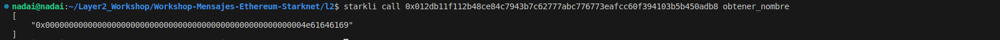


## Instalación de Starkli
[Starkli](https://book.starkli.rs/introduction) es una interfaz de línea de comandos que te permite interactuar con Starknet. Esta es una de las herramientas que nos permite interactuar con Starknet, sin embargo, no es la única. 
Starkliup es el instalador del entorno Starkli, y se puede instalar fácilmente utilizando la línea de comando con curl:

```bash
curl https://get.starkli.sh | sh
```

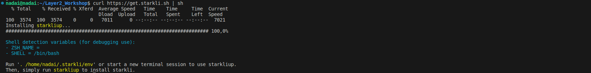

Puede que necesites reiniciar tu sesión de shell para que el comando starkliup esté disponible. Una vez que esté disponible, ejecuta el comando starkliup:

```bash
starkliup
```

Starkliup detecta la plataforma de tu dispositivo y descarga automáticamente el binario precompilado adecuado. También configura las autocompletaciones de la shell. Es posible que necesites reiniciar tu sesión de shell para que las autocompletaciones comiencen a funcionar.

Ejecutar estos comandos instalará starkli para ti y lo actualizará a la última versión si ya está instalado.

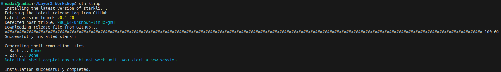


Reinicie el terminal y ejecute el siguiente comando para verificar la instalación:

```bash
starkli --version
```

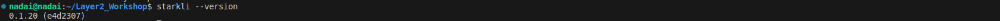

**Para actualizar a la última versión de Starkli, simplemente siga los pasos anteriores nuevamente.**

---
## Instalación de Scarb
[Scarb](https://docs.swmansion.com/scarb/) es el administrador de paquetes para Cairo. Entre otras cosas, nos permite compilar código Cairo a Sierra, el lenguaje intermedio entre el Cairo de alto nivel y el ensamblador Cairo de bajo nivel (CASM). Para usuarios de macOS y Linux, abra su terminal y ejecute el siguiente comando:

```bash
curl --proto '=https' --tlsv1.2 -sSf https://docs.swmansion.com/scarb/install.sh | sh
```

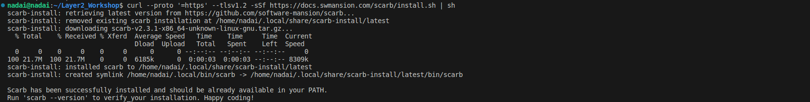


Reinicie el terminal y ejecute el siguiente comando para verificar la instalación:

```bash
scarb --version
```

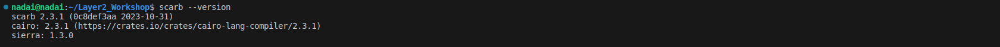


Puede ejecutar el mismo comando para actualizarlo o directamnete añadir la versión manual de la versión que necesite de [aquí](https://github.com/software-mansion/scarb/releases)

```bash
curl --proto '=https' --tlsv1.2 -sSf https://docs.swmansion.com/scarb/install.sh | sh -s -- -v 0.6.0-alpha.4
```

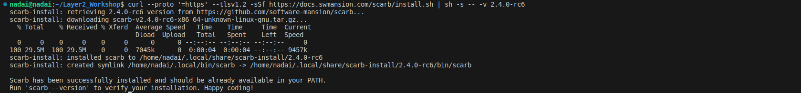

Ejecute el siguiente comando para verificar su nueva versión, está vez la `2.1.0-rc4`:

```bash
scarb --version
```

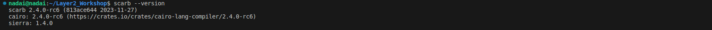


Aunque esta información se proporciona en caso de que desee instalar una versión específica, se recomienda instalar la versión estable utilizando el primer comando o siempre revisar las compatibilidades de las versiones del compilador [aquí](https://github.com/software-mansion/scarb/releases).

Puede verificar ahora que tanto `Scarb` como `Starkli` están instalados y listos para probar esta poderosa combinación de herramientas para Starknet y Cairo. Para esta guía, hemos configurado estas versiones como las más estables y actualizadas:

```bash
scarb --version 
starkli  --version 
```

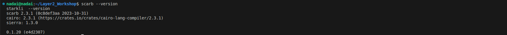


### Conseguir Faucet
Aquí hay varios enlaces y métodos que le proporcionaremos para que pueda desplegar su contrato de cuenta. En este caso, utilizaremos la red de prueba de Goerli en Starknet, donde podrá recibir fondos ETH de varias maneras:

1. **Desde un Faucet de Starknet:** Puede obtener fondos ETH de forma gratuita en la red Goerli de Starknet utilizando el [Faucet Starknet](https://faucet.goerli.starknet.io/).

2. **A través de Starkgate Bridge L1-L2:** También puede transferir fondos desde la capa 1 (L1) de Ethereum en Goerli a la capa 2 (L2) de Starknet utilizando el [Starkgate Bridge L1-L2](https://goerli.starkgate.starknet.io/).

3. **Depositando ETH desde otra dirección:** Tienes la opción de depositar ETH en su contrato de cuenta desde otra dirección de prueba de Starknet o cualquier otra billetera compatible con la red de prueba.


## Integrando Scarb en tu Flujo de Desarrollo 
Los siguientes pasos ilustran un flujo de trabajo típico para desarrollar un contrato Starknet utilizando Scarb, aunque si ha cloando este repositorio y quiere sólo seguir los procesos, pase directamente al paso 4.

1. Inicialización del Proyecto: Comienza ejecutando `scarb new` para crear un nuevo proyecto. Este comando generará automáticamente la estructura básica del proyecto, incluyendo un archivo de configuración `Scarb.toml` y un archivo inicial `src/lib.cairo`.

2. Desarrollo del Contrato: Escribe tu código Cairo y guárdalo en el directorio src, en este caso usaremos como base un contrato de Propiedad `Owner.cairo`

3. Gestión de Dependencias: Si tu contrato depende de bibliotecas externas, utiliza `scarb add` para incluir fácilmente estas dependencias en tu proyecto.

4. Compilación del Contrato: Ejecuta `scarb build` para compilar tu contrato en código Sierra. Este código resultante puede luego ser examinado con más detalle o utilizado como entrada para otras herramientas o procesos.

Al integrar Scarb en tu flujo de trabajo, aprovechas sus características para hacer tu proceso de desarrollo más eficiente y manejable.


### Gestión de Dependencias
Una vez hayas copiado los pasos anteriores de este taller, deberás guardar todos los cambios en tu editor de código y proceder a modificar tu archivo `Scarb.toml`. En la sección `[dependencies]`, podrás añadir dependencias externas como por ejemplo las de OpenZeppelin u otras que necesites. Además, asegúrate de que en la sección `[[target.starknet-contract]]` de tu archivo `Scarb.toml` especifiques `sierra = true` para que la compilación genere el código en la representación intermedia de Sierra en formato `.json`.

Es importante señalar que si no indicas `sierra = true` en la sección correspondiente, la compilación generará el código en formato `casm`, que es una versión cruda de Cairo. Dado que necesitamos la representación intermedia de Sierra para que el contrato sea más legible y tenga propiedades de seguridad, es esencial habilitar esta opción.

Tu archivo `Scarb.toml` básico inicial para este ejemplo será:

```toml
[package]
name = "Workshop"
version = "0.1.0"

[dependencies]
starknet = ">=2.3.0"

[[target.starknet-contract]]
sierra = true
```

---

### Extensión Cairo VS Code 
Para trabajar con la sintaxis de Cairo de manera efectiva y detectar automáticamente la versión del compilador, así como facilitar la corrección de errores, es altamente recomendable utilizar la extensión `Cairo 1` en VS Code. Siga estos pasos para configurarla:

1. Abra Visual Studio Code.

2. Diríjase a la sección de extensiones. Puede hacerlo haciendo clic en el ícono de `Extensiones` en la barra lateral izquierda o presionando `Ctrl + Shift + X`.

3. En la barra de búsqueda de extensiones, escriba `Cairo 1`.

4. Aparecerá la extensión `Cairo 1`. Haga clic en `Instalar` para descargarla e instalarla en su entorno de VS Code.

5. Una vez que la extensión esté instalada, podrá detectar automáticamente la versión del compilador Cairo a partir del archivo de manifiesto de su proyecto `Scarb`. Asegúrese de tener `Scarb` instalado correctamente. También puede configurar su activación desde los ajustes revisando el estado activo de las casillas `Cairo1: Enable Scarb`, o en caso de que siga teniendo problemas después de reiniciar, añadir las rutas del paquete binario de Scarb en `Cairo1: Scarb Path`.


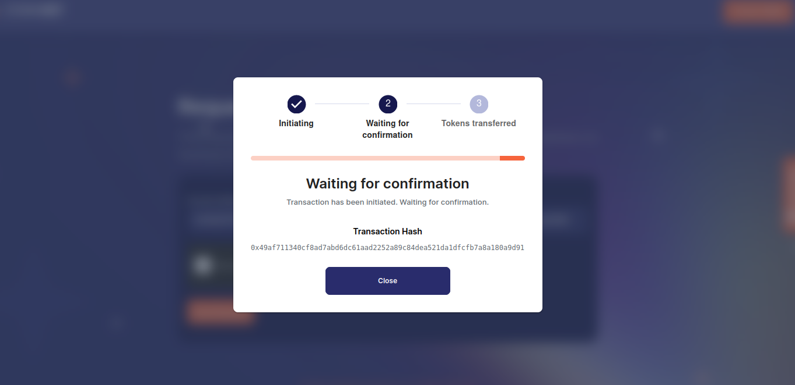

Esto facilita la corrección de errores y asegura que su código se ajuste a la versión específica del compilador.

Con la extensión `Cairo 1` configurada en su entorno de Visual Studio Code, estará listo para trabajar de manera eficiente con la sintaxis de Cairo y aprovechará las funciones de detección de errores y corrección automática proporcionadas por la extensión. Esto es especialmente útil para desarrollar aplicaciones en Cairo de manera más efectiva y sin problemas.

---

### Compilación del Contrato
Ahora procederemos a compilar nuestro [`Owner.cairo`](/Workshop/src/Owner.cairo). Si ha clonado este repositorio (recuerde que puede hacerlo con el comando `git clone ...`), le bastará con ejecutar un comando para llevar a cabo la compilación:

```bash
scarb build
```

Si todo ha ido bien, se debería crear una carpeta `dev/target` que contendrá el archivo `Workshop_Ownable.sierra.json`, así como otros contratos adicionales. Aunque nos centraremos en `Owner.cairo`, podría realizar la misma acción para el resto, estos archcvos en versión `sierra.json` los necesitaremospara llevar a cabo las operaciones de `Declare` y `Deploy` Si, por cualquier motivo, no se genera este archivo, puede intentar borrar la carpeta `target` y luego volver a ejecutar el comando `scarb build`.

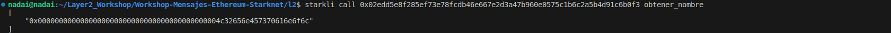

---

## Declare del Contrato con Starkli
Una vez tengamos todo preparado realizaremos la declaración del `Owner.cairo`, está declaración nos servirá para establecer una estrucutra que nos sirva para usar en el futuruo y si queremos volver a usar este contrato, solo usar su mismo `Class Hash` que nos ha dado, y pasar los argumetnos del construcutor que queremos, asi podrimaos tener un `Class hash` de un `ERC-20` standar o con ciertas propiedades, pero cada uno con su owner, nombre, simbolo, total supply o direrentes logicas que s proramaran.

Siempre es importante verificar que los `EXPORT` se hayan realizado correctamente para interactuar con la red de Starknet. 

```bash
export STARKNET_KEYSTORE=~/.starkli-wallets/deployer/Signer_Workshop.json
export STARKNET_ACCOUNT=~/.starkli-wallets/deployer/Account_Workshop.json
```

Si nos encontramos en la carptea raiz de nuestro proyecto tenemos dos opciones, o ir directamente a nuestra carpeta `dev` y ejecutar el `declare` con `starkli`:

```bash
starkli declare --watch Workshop_Ownable.sierra.json
```

O directamente indicando donde se encuentra nuestro archivo.

```bash
starkli declare --watch ./target/dev/Workshop_Ownable.sierra.json
```

Si recibe algun error revise si es por falta de encontrar el archivo, por lo que está indicando mal la ruta, nombre O al abrir una carpeta nueva se olvido de hacer los `export`, o puso su contraseña mal....El resultado que debería de obtener son los datos de Netowr utulizada, Versión del Compile, hash de la tranasación y la cmpilación a Sierra desde Casm la que nos generará un `Class hash` que deberemos guardar para ahora nuesto despliege

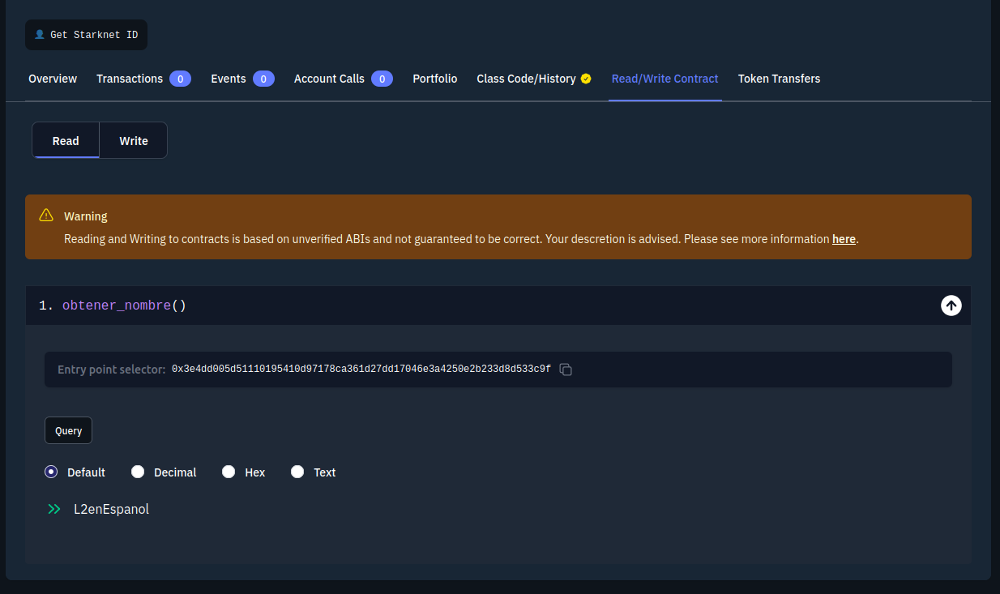

En este ejemplo usaremos `Class hash declared:0x064660ad51db85a7c7c5aa7e2adb0b51c5b86526f02f233368e5e03bb7e702e7`

---

### Despliegue del Contrato con Starkli
Ahora que hemos declarado nuestro contrato, si no se había hecho anteriormente y es único, podemos omitir la declaración y proceder directamente al despliegue. Para ello, debemos asegurarnos de revisar los argumentos que se pasan al constructor del contrato. En primer lugar, debemos proporcionar el `Class hash` del contrato que queremos desplegar, en este caso será `0x064660ad51db85a7c7c5aa7e2adb0b51c5b86526f02f233368e5e03bb7e702e7`. Además, en el constructor vemos que se requiere la dirección del contrato que actuará como el `owner`, así que en este caso añadiremos la dirección creada para la prueba y financiada para el taller, que es `0x009f47ebc2b3062b99e52f3b20b7bce93c6adc19911500cf569ac502fef90f6e`.

```rust
#[constructor]
fn constructor(ref self: ContractState, init_owner: ContractAddress) {
    self.owner.write(init_owner);
}
```

Por lo tanto, ejecutamos el siguiente comandosy añadimos el argumento requerido de la siguiente manera:


```bash
starkli deploy --watch 0x064660ad51db85a7c7c5aa7e2adb0b51c5b86526f02f233368e5e03bb7e702e7 0x009f47ebc2b3062b99e52f3b20b7bce93c6adc19911500cf569ac502fef90f6e
```

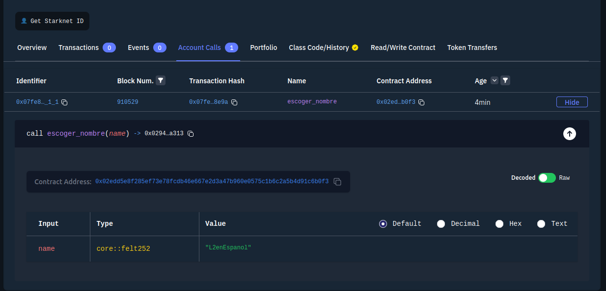

Puedes consultar el [enlace del contrato del "Owner"](https://testnet.starkscan.co/contract/0x028491f9e3d8b0005a649e08833330de371b5e227be05a0e0575f247df8691a5#read-write-contract) para asegurarte de que todo esté correcto. Además, con Starkli, puedes realizar llamadas directas al contrato para verificar que todo esté en orden.


-----------------------------------------------------
-----------------------------------------------------
-----------------------------------------------------

```bash
mkdir -p ~/.starkli-wallets/deployer
```

## PK de OZ o desde 0

```bash
starkli signer keystore new ~/.starkli-wallets/deployer/Signer_Workshop.json
```

```bash
export STARKNET_KEYSTORE=~/.starkli-wallets/deployer/Signer_Workshop.json
```


```bash
starkli account oz init ~/.starkli-wallets/deployer/Account_Workshop.json
```


## PK Braavos o Argent

```bash
starkli signer keystore from-key ~/.starkli-wallets/deployer/Signer_Braavos.json
```

```bash
starkli account fetch 0x027f68d0d0f474b1a25f359a42dc49a3003a3522d71765a5e7658e68520d7826 --output ~/.starkli-wallets/deployer/Account_Braavos.json
```

## PK desde 0

```bash
starkli signer gen-keypair
```


## PK Katana

```bash
starkli signer keystore from-key ~/.starkli-wallets/deployer/SignerKatana_Workshop.json
```

```bash
starkli account fetch 0x517ececd29116499f4a1b64b094da79ba08dfd54a3edaa316134c41f8160973 --rpc http://0.0.0.0:5050 --output ~/.starkli-wallets/deployer/AccountKatana_Workshop.json
```


# Starknet OZ Goerli

```bash
export STARKNET_ACCOUNT=~/.starkli-wallets/deployer/Account_Workshop.json
export STARKNET_KEYSTORE=~/.starkli-wallets/deployer/Signer_Workshop.json
```

# Variables de Entorno de Starknet Braavos/Argent 

```bash
export STARKNET_ACCOUNT=~/.starkli-wallets/deployer/Account_Braavos.json
export STARKNET_KEYSTORE=~/.starkli-wallets/deployer/Signer_Braavos.json
```

# Variables de Entorno de Katana

```bash
export STARKNET_ACCOUNT=~/.starkli-wallets/deployer/AccountKatana_Workshop.json
export STARKNET_KEYSTORE=~/.starkli-wallets/deployer/SignerKatana_Workshop.json
```


---


- [Contract WorkshopMensajeL1](https://goerli.etherscan.io/address/0xb604ba0ff29eb29f33b912b9e3a9659ac385a780)

- [Contract WorkshopMensajeL2](https://goerli.voyager.online/contract/0x034a39d6f4c991787c35a884a004103cf5b57ba4f86bd46866f2502b8634d7c2)


---


## Katana

```bash
starkli signer keystore from-key ~/.starkli-wallets/deployer/SignerKatana_Workshop.json
```

0x1800000000300000180000000000030000000000003006001800006600

```bash
starkli account fetch 0x517ececd29116499f4a1b64b094da79ba08dfd54a3edaa316134c41f8160973 --rpc http://0.0.0.0:5050 --output ~/.starkli-wallets/deployer/AccountKatana_Workshop.json
```


```bash
export STARKNET_ACCOUNT=~/.starkli-wallets/deployer/AccountKatana_Workshop.json
export STARKNET_KEYSTORE=~/.starkli-wallets/deployer/SignerKatana_Workshop.json
```


```bash
starkli declare --watch target/dev/l2_WorkshopMensajesL2.contract_class.json --rpc http://0.0.0.0:5050 --account ~/.starkli-wallets/deployer/AccountKatana_Workshop.json --keystore ~/.starkli-wallets/deployer/SignerKatana_Workshop.json
```


```bash
starkli deploy 0x001f096a80def43ef5e71513053dc8e187c5eed93f2f5ead4b722cb5b3e69782 --rpc http://0.0.0.0:5050 --account ~/.starkli-wallets/deployer/AccountKatana_Workshop.json --keystore ~/.starkli-wallets/deployer/SignerKatana_Workshop.json
```

# Owner Katana

```bash
starkli declare --watch target/dev/l2_Ownable.contract_class.json --rpc http://0.0.0.0:5050 --account ~/.starkli-wallets/deployer/AccountKatana_Workshop.json --keystore ~/.starkli-wallets/deployer/SignerKatana_Workshop.json
```

```bash
starkli deploy 0x04c63116efd62f59cc384a61c4ad694f8d09c55362293599f00aca8af2fc036c 0x517ececd29116499f4a1b64b094da79ba08dfd54a3edaa316134c41f8160973 --rpc http://0.0.0.0:5050 --account ~/.starkli-wallets/deployer/AccountKatana_Workshop.json --keystore ~/.starkli-wallets/deployer/SignerKatana_Workshop.json
```

```bash
starkli call 0x036e6adaec875829d9aceed5933d90c8e26df6af291fe35625e8e471b0e1a8f9 get_owner --rpc http://0.0.0.0:5050
```

```bash
starkli invoke 0x036e6adaec875829d9aceed5933d90c8e26df6af291fe35625e8e471b0e1a8f9 transfer_ownership 0x2b191c2f3ecf685a91af7cf72a43e7b90e2e41220175de5c4f7498981b10053 --rpc http://0.0.0.0:5050 --account ~/.starkli-wallets/deployer/AccountKatana_Workshop.json --keystore ~/.starkli-wallets/deployer/SignerKatana_Workshop.json
```

----

## Comandos 

starkli to-cairo-string Nadai

starkli parse-cairo-string 0x4e61646169

Nadai2 = 0x4e6164616932

starkli call 0x022b4a07962546207fdde7c0bbaf0c6183274d4a1b8c318f91b485b566975916 obtener_nombre

starkli class-hash target/dev/workshop_l2_hola.contract_class.json

starkli class-hash-at 

## Variables de entorno env

cp .env.example .env
source .env

## Variables de entorno sh

```bash
touch ~/.starkli-wallets/deployer/envarsKatana.sh
touch ~/.starkli-wallets/deployer/envarsBraavos.sh
touch ~/.starkli-wallets/deployer/envarsWorkshop.sh
```

**Katana**

```bash
#!/bin/bash 
export STARKNET_ACCOUNT=~/.starkli-wallets/deployer/AccountKatana_Workshop.json 
export STARKNET_KEYSTORE=~/.starkli-wallets/deployer/SignerKatana_Workshop.json
export STARKNET_RPC=http://0.0.0.0:5050
```

**Braavos**

```bash
#!/bin/bash
export STARKNET_ACCOUNT=~/.starkli-wallets/deployer/Account_Braavos.json
export STARKNET_KEYSTORE=~/.starkli-wallets/deployer/Signer_Braavos.json
```

**OpenZeppelin**

```bash
#!/bin/bash
export STARKNET_ACCOUNT=~/.starkli-wallets/deployer/Account_Workshop.json
export STARKNET_KEYSTORE=~/.starkli-wallets/deployer/Signer_Workshop.json
```

```bash
source ~/.starkli-wallets/deployer/envarsKatana.sh
source ~/.starkli-wallets/deployer/envarsBraavos.sh
source ~/.starkli-wallets/deployer/envarsWorkshop.sh
```

-----------------------------------------------------------------
-----------------------------------------------------------------
-----------------------------------------------------------------

## Gestión de Dependencias Externas en Scarb
En Scarb, puedes añadir y gestionar las dependencias desde el archivo `Scarb.toml`. Añadir una dependencia es fácil y se puede hacer de varias maneras, una de ellas es utilizando el comando `scarb add`, que admite una variedad de parámetros para expresar tus dependencias. También puede mantener automáticamente la lista de dependencias ordenada, si no lo está. A continuación, se muestra un ejemplo de cómo agregar una dependencia, como alexandria_math:

```shell
scarb add alexandria_math --git https://github.com/keep-starknet-strange/alexandria.git --rev 27fbf5b
```

Para eliminar una dependencia, simplemente debes eliminar las líneas relacionadas en tu archivo Scarb.toml. Como atajo rápido, puedes utilizar el comando `scarb remove`, también conocido como `scarb rm`, que limpiará automáticamente el manifiesto de dependencias, debes indicar cual quieres eliminar como se muestra aquí:

```shell
scarb rm alexandria_math
```

Con estas herramientas, puedes gestionar tus dependencias de manera eficiente en Scarb y mantener tu proyecto organizado.


### Call
Desde Starkli, puedes cambiar el estado de un contrato, realizar operaciones o hacer consultas a datos y estados de la blockchain. Así que comprobemos si nuestro contrato de `Owner.cairo` tiene la dirección del contrato de la cuenta que hemos añadido. Para ello, debemos realizar una `call` e indicar qué función queremos invocar. Lo bueno de Starknet son los selectores, y en este caso, llamaremos a la función `get_owner` del contrato para obtener información sobre quién es el propietario, en este caso sólo es una `call` que no modifica el estado.

```bash
starkli call 0x028491f9e3d8b0005a649e08833330de371b5e227be05a0e0575f247df8691a5 get_owner
```

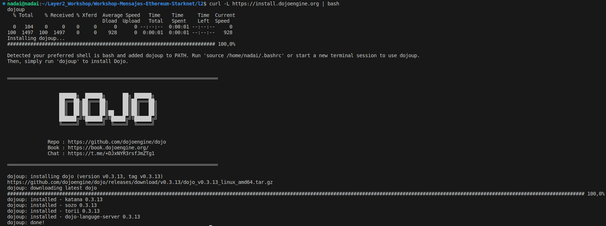

---
### Invoke
Desde Starkli, tienes la capacidad de llevar a cabo una invocación `invoke`. Esta característica te permite realizar operaciones que tienen el potencial de modificar el estado de un contrato en la blockchain. Para ejecutar un `invoke`, debes proporcionar ciertos parámetros clave, como la `dirección del contrato` que deseas modificar y la función específica que deseas ejecutar en ese contrato, en este ejemplo, `transfer_ownership`. Además, es necesario indicar los argumentos necesarios para la función que estás invocando, como la nueva dirección `0x027f68d0d0f474b1a25f359a42dc49a3003a3522d71765a5e7658e68520d7826`. Esta acción podría resultar en una transferencia de propiedad en el contrato, lo que modificaría su estado interno.

```bash
starkli invoke --watch 0x028491f9e3d8b0005a649e08833330de371b5e227be05a0e0575f247df8691a5 transfer_ownership 0x027f68d0d0f474b1a25f359a42dc49a3003a3522d71765a5e7658e68520d7826
```

## Guía Mensajes L1<->L2

- Tener Instalado y cuenta en MM
- Tener Instalado y contrato de ceutna en Braavos o Argent X
- Tener saldo en Goerli en L1<->L2
- Remix para L1
- API Key en etherscan


