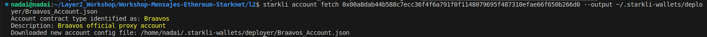
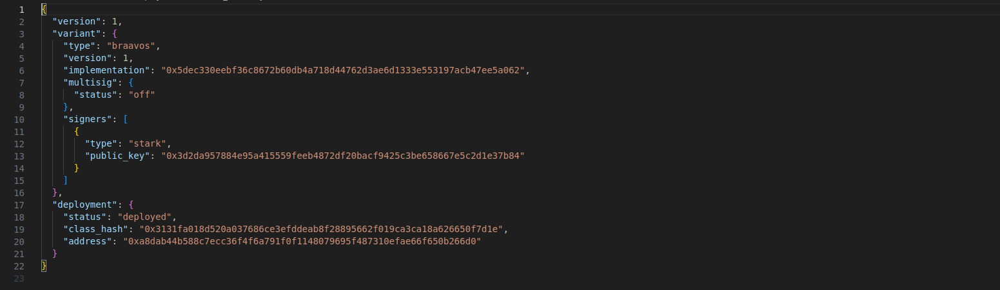

<div align="center">

  <h1 style="font-size: larger;">
  <strong> Workshop de Cero a Héroe:</strong>
   <br/>
  <strong> SEED Latam-Layer 2 en Español-StarknetEs </strong> 
   
  </h1>
    
    
    
    <br/><br/>


<a href="https://www.youtube.com/live/xw9zuXyrStE?si=4QtHcuT7qb399JLX">

</a>
<a href="https://www.youtube.com/live/xw9zuXyrStE?si=4QtHcuT7qb399JLX">

</a>
<a href="https://www.youtube.com/live/xw9zuXyrStE?si=4QtHcuT7qb399JLX">

</a>
<a href="https://www.youtube.com/live/xw9zuXyrStE?si=4QtHcuT7qb399JLX">

</a>
    <br/><br/>
</a>
<a href="https://twitter.com/SEEDLatam">

</a>
<a href="https://twitter.com/Layer2es">

</a>
<a href="https://twitter.com/StarkNetEs">

</a>
    <br/><br/>
<a href="https://github.com/Layer2es">

<a href="https://github.com/Starknet-Es">

<a href="https://github.com/Layer2es/Workshop-Mensajes-Ethereum-Starknet">

</a>


</div>

## Recursos oficiales

- [Starknet Doc](https://docs.starknet.io/documentation/) - Documentos oficiales de Starknet
- [Starknet Book](https://book.starknet.io/) - Libro de Starknet
- [Cairo Doc](https://www.cairo-lang.org/docs/) - Documentos oficiales de de Cairo
- [Libro Cairo](https://cairo-book.github.io/) - Libro de Cairo
- [Libro L2 en Español](https://layer2es.github.io/Book-Starkware/) - Libro escrito por el equipo de L2 en Español sobre el ecosistema de Starknet, Criptografía Básica y temas más profundos de la arquitectura y en general de Starknet.
- [Sintaxis Cairo by Nethermind](https://github.com/NethermindEth/CairoByExample/) | [Sintaxis Cairo by LambdaClass](https://github.com/lambdaclass/cairo-by-example/) | [Starklings](https://github.com/shramee/starklings-cairo1) | [CairoPractice](https://cairopractice.com/) - Colecciones de ejemplos y tutoriales interactivos de aprendizaje en Cairo. 
- [Stark Utils](https://www.stark-utils.xyz/) - Herramienta para convertir tus valores de Cairo, convierte `felt`, `hex`, `string`, `selector`...

---

## Temas 

- [Pre-requisitos](#pre-requisitos)
 - [Git](#git)
 - [Curl](#curl)
- [Instalación de Starkli](#instalación-de-starkli)
- [Instalación de Scarb](#instalación-de-scarb)
- [Instalación de Dojo y Katana](#instalación-de-dojo-y-katana)
- [Conseguir Faucet](#conseguir-faucet)
- [Cuentas y Firmantes](#cuenta-y-firmantes)
    - [Crear Cuenta con Starkli (Opción A)](#crear-cuenta-con-starkli-opción-a)      
    - [Desplegar Contrato de Cuenta A](#desplegar-contrato-de-cuenta-a)
    - [Crear Cuenta ArgentX o Braavos (Opción B)](#crear-cuenta-argentx-o-braavos-opción-b)
    - [Desplegar Contrato de Cuenta B](#desplegar-contrato-de-cuenta)
- [Configuración de Variables de Entornos](#configuración-de-variables-de-entorno-b)
- [Integrando Scarb en tu Flujo de Desarrollo](#integrando-scarb-en-tu-flujo-de-desarrollo)
    - [Inicialización del Proyecto](#inicialización-del-proyecto)
    - [Desarrollo del Contrato Hola.cairo](#desarrollo-del-contrato)
    - [Gestión de Dependencias](#gestión-de-dependencias)
    - [Extensión Cairo VS Code](#extensión-cairo-vs-code)
    - [Compilación del Contrato Hola.cairo](#compilación-del-contrato)
- [Declare del Contrato Hola.cairo con Starkli](#declare-del-contrato-con-starkli)
- [Despliegue del Contrato Hola.cairo con Starkli](#despligue-del-contrato-con-starkli)
- [Katana con Starkli]
    - [Compilar, Desplegar e Interactuar con el Contrato Owner.cairo]
- [Invocando Contratos con Starkli](#invocando-contratos-con-starkli)
- [Workshop Mensajes L2<->L1]
    - [Compile y Deploy en Remix Contract L1]
    - [Compile y Deploy con Starkli Contract L2]
    - [Manejos de Mensajes enviados y consumirlos]
- [Comandos Extras de Starkli](#comandos-starkli)
- [Gestión de Dependencias Externas en Scarb](#gestión-de-dependencias-externas-en-scarb)


---

# Workshop-Mensajes-Ethereum-Starknet

- Instalar Scarb
- Instalar Starkli
- Instalar Katana
- Crear Cuenta
- Declarar y desplegar Hola
- Remix L1 y L2
- Envios de Mensajes
- Probar Katana con Hola

- Cuenta Workshop 
0x01019f481359b39d0673b37502b898a5c9d9ddece0948596d3a191664c1eaa08

   

## Pre-requisitos
Antes de empezar, asegúrese de tener instalados los siguientes pre-requisitos en su sistema:

### Git
[Git:](https://git-scm.com/) Será necesario tener `Git` instalado. A continuación, se muestra el comando para instalar `Git` en Ubuntu. Recuerda verificar las versiones disponibles para tu sistema operativo en el enlace proporcionado:

```bash
apt-get install git
```

Si se produce un error y te solicita entrar como administrador, agrega `sudo` al principio del comando. Se abrirá una ventana para ingresar tu contraseña (que será invisible) y luego puedes presionar Enter para continuar.

```bash
sudo apt-get install git
```

### Curl
El procedimiento para instalar `cURL` en Ubuntu Linux es el siguiente:

- Actualiza tu sistema Ubuntu ejecutando: 

```bash
sudo apt update && sudo apt upgrade
```

- A continuación, instala cURL ejecutando: 

```bash
sudo apt install curl
```

- Verifica la instalación de cURL en Ubuntu ejecutando:

```bash
curl --version
```


## Clonado Repositorio
Ahora podrá proceder a hacer un `clone` de nuestro repositorio para obtener toda la configuración y contratos preparados para compilar y deplegar, para ello deberá pasar el comando:

```bash
git clone git@github.com:Layer2es/Workshop-Mensajes-Ethereum-Starknet.git
```

## Instalación de Starkli
[Starkli](https://book.starkli.rs/introduction) es una interfaz de línea de comandos que te permite interactuar con Starknet. Esta es una de las herramientas que nos permite interactuar con Starknet, sin embargo, no es la única. 
Starkliup es el instalador del entorno Starkli, y se puede instalar fácilmente utilizando la línea de comando con curl:

```bash
curl https://get.starkli.sh | sh
```


Puede que necesites reiniciar tu sesión de shell para que el comando starkliup esté disponible. Una vez que esté disponible, ejecuta el comando starkliup:

```bash
starkliup
```

Starkliup detecta la plataforma de tu dispositivo y descarga automáticamente el binario precompilado adecuado. También configura las autocompletaciones de la shell. Es posible que necesites reiniciar tu sesión de shell para que las autocompletaciones comiencen a funcionar.

Ejecutar estos comandos instalará starkli para ti y lo actualizará a la última versión si ya está instalado.


Reinicie el terminal y ejecute el siguiente comando para verificar la instalación:

```bash
starkli --version
```


**Para actualizar a la última versión de Starkli, simplemente siga los pasos anteriores nuevamente.**

---
## Instalación de Scarb
[Scarb](https://docs.swmansion.com/scarb/) es el administrador de paquetes para Cairo. Entre otras cosas, nos permite compilar código Cairo a Sierra, el lenguaje intermedio entre el Cairo de alto nivel y el ensamblador Cairo de bajo nivel (CASM). Para usuarios de macOS y Linux, abra su terminal y ejecute el siguiente comando:

```bash
curl --proto '=https' --tlsv1.2 -sSf https://docs.swmansion.com/scarb/install.sh | sh
```


Reinicie el terminal y ejecute el siguiente comando para verificar la instalación:

```bash
scarb --version
```


Puede ejecutar el mismo comando para actualizarlo o directamente añadir la versión manual de la versión que necesite de [aquí](https://github.com/software-mansion/scarb/releases)

```bash
curl --proto '=https' --tlsv1.2 -sSf https://docs.swmansion.com/scarb/install.sh | sh -s -- -v 2.4.0-rc6
```


Ejecute el siguiente comando para verificar su nueva versión, está vez la `2.4.0-rc6`:

```bash
scarb --version
```


---


Si bien se proporciona esta información para aquellos que deseen instalar una versión específica, se recomienda encarecidamente la instalación de la versión estable utilizando el primer comando o siempre verificar las compatibilidades de las versiones del compilador [aquí](https://github.com/software-mansion/scarb/releases).

Para aprovechar al máximo esta potente combinación de herramientas para Starknet y Cairo, ahora puede confirmar si tanto `Scarb` como `Starkli` están instalados y listos. Hemos configurado estas versiones como las más estables y actualizadas para esta guía:


```bash
scarb --version 
starkli --version 
```


---


¡Claro! Aquí tienes una versión mejorada:

---

## Instalación de Dojo y Katana
Katana, creada por el equipo de Dojo, está diseñada para facilitar el desarrollo local. Esta herramienta permite realizar todas las actividades relacionadas con Starknet en un entorno local, lo que la convierte en una plataforma eficiente para el desarrollo y las pruebas.

Para instalar este entorno local, necesitaremos instalar Dojo con el siguiente comando:

```bash
curl -L https://install.dojoengine.org | bash
dojoup
```


Una vez instalado `katana`, podemos verificar su versión con el siguiente comando:

```bash
katana --version
```


Con `katana`, tenemos la opción de levantar este nodo local para interactuar con él. Aunque `katana` por sí solo debería ser suficiente, recomendamos ejecutarlo con la opción `--disable-fee` para evitar problemas de costes de gas por transacción. En este ejemplo, configuramos `katana` para lanzar solo `3 cuentas` en lugar de las `10 cuentas` predeterminadas:

```bash
katana --disable-fee --accounts 3
```

Si todo ha funcionado correctamente, `Katana` debería estar activo y listo para ser configurado con diversas opciones. Se integra perfectamente con el flujo de trabajo de otras herramientas como starkli.


---

### Conseguir Faucet
Aquí hay varios enlaces y métodos que le proporcionaremos para que pueda desplegar su contrato de cuenta. En este caso, utilizaremos la red de prueba de `Goerli` en Starknet, aunque a finales del 2023 será deprecada y se recomienda empezar a usar `Sepolia` siguiendo el mismo proceso, en estas redes de prueba podrá recibir fondos ETH de varias maneras:

1. **Desde un Faucet de Starknet:** Puede obtener fondos ETH de forma gratuita en la red Goerli de Starknet utilizando el [Faucet Starknet](https://faucet.goerli.starknet.io/).

2. **A través de Starkgate Bridge L1-L2:** También puede transferir fondos desde la capa 1 (L1) de Ethereum en Goerli a la capa 2 (L2) de Starknet utilizando el [Starkgate Bridge L1-L2](https://goerli.starkgate.starknet.io/).

3. **Depositando ETH desde otra dirección:** Tienes la opción de depositar ETH en su contrato de cuenta desde otra dirección de prueba de Starknet o cualquier otra billetera compatible con la red de prueba.

---

## Crear Contrato de Cuenta y Firmantes

Las billeteras inteligentes en Starknet se componen de dos elementos: un `firmante` y un `descriptor de cuenta`. Estos elementos son esenciales para interactuar con Starknet, permitiendo firmar transacciones y proporcionando información relevante sobre la billetera inteligente.

- El `firmante` es un contrato inteligente capaz de firmar transacciones, cuya clave privada es necesaria para su creación.
- El `descriptor de cuenta` es un archivo JSON que contiene información crítica sobre la billetera inteligente, como su dirección y clave pública.

Usaremos 2 opciones para crear nuestra cuenta:

- **Opción A:** Configuraremos nuestro entorno de desarrollo utilizando las lógicas de OZ (OpenZeppelin) y Starknet para crear un nuevo Contrato de Cuenta.

- **Opción B:** Crearemos la cuenta a través de Argent o Braavos, exportando nuestra clave privada.

---

## Creación de Firmantes con Starkli

Starkli emplea `firmantes` o `signers` para autorizar transacciones. Estos pueden ser contratos inteligentes o archivos que almacenan claves privadas. Aquí se presenta cómo crear un firmante utilizando Starkli:

### Opción A: Crear Cuenta, Firmante y Descriptor de Cuenta con OZ

1. **Crear un Firmante**: Utilice Starkli para generar un archivo `keystore` que proteja la clave privada de su billetera inteligente:

    ```bash
    mkdir -p ~/.starkli-wallets/deployer
    starkli signer keystore new ~/.starkli-wallets/deployer/Signer_Workshop.json
    ```

    Esto generará un archivo cifrado llamado `Signer_Workshop.json`.

2. **Establecer Variable de Entorno**: Cree una variable de entorno `STARKNET_KEYSTORE` para facilitar la gestión de claves:

    ```bash
    export STARKNET_KEYSTORE=~/.starkli-wallets/deployer/Signer_Workshop.json
    ```

3. **Crear Descriptor de Cuenta**: Crea la cuenta que estará controlada por el `signer` que se ha creado:

    ```bash
    starkli account oz init ~/.starkli-wallets/deployer/Account_Workshop.json
    ```

    Este archivo `Account_Workshop.json` estará en estado `undeployed`, listo para ser desplegado después de recibir saldo.

### Opción B: Crear Cuenta, Firmante y Descriptor de Cuenta con Argent o Braavos

1. **Crear Billetera Inteligente**: Siga las instrucciones proporcionadas por las extensiones del navegador [Braavos](https://braavos.app/download-braavos-wallet/) o [Argent X](https://www.argent.xyz/argent-x/) para crear una billetera inteligente.

2. **Exportar Clave Privada**: Exporte la clave privada desde la configuración de su cuenta en Braavos o Argent X. Luego, cree un firmante con Starkli utilizando esta clave privada con el siguiente comando:

    ```bash
    starkli signer keystore from-key ~/.starkli-wallets/deployer/Braavos_Signer.json
    ```

    Con esta parte, habremos configurado nuestro firmante, y a continuación, definiremos cómo utilizaremos nuestro Contrato de Cuenta creando un Descriptor de Cuenta con la información necesaria.

3. **Crear Descriptor de Cuenta**: Crea la cuenta que estará controlada por el `signer` que se ha creado:

    ```bash
    touch ~/.starkli-wallets/deployer/Braavos_Account.json
    ```

    Deberemos exportar un punto de RPC para que pueda conseguir los datos de nuestro contrato de cuenta para crear el Descriptor usando el siguiente comando:

    ```bash
    export STARKNET_RPC="https://starknet-goerli.infura.io/v3/6e7788ff3c784159993c45a949172f0e"
    ```

    Ahora podremos pasar el comando con la dirección de nuestra cuenta de Braavos o Argent para crear nuestro Descriptor de Cuenta:

    ```bash
    starkli account fetch 0x00a8dab44b588c7ecc36f4f6a791f0f1148079695f487310efae66f650b266d0 --output ~/.starkli-wallets/deployer/Braavos_Account.json
    ```

    

    Esto nos dará nuestro archivo `.json` con toda la información relevante para poder usar nuestra cuenta recien exportada.

    

Con estas 2 opciones conseguimos tener nuestra cuenta exportada e integrada en nuestro flujo de trabajo para desarrollar con ellas.

Acceda directamente [aquí]() si quiere ir directamente a diversas formas de trabajar con las variables de entorno de la forma que vea más útil.

---


## Integrando Scarb en tu Flujo de Desarrollo 
Los siguientes pasos ilustran un flujo de trabajo típico para desarrollar un contrato Starknet utilizando Scarb, aunque si ha clonado este repositorio y quiere sólo seguir los procesos, pase directamente al paso 5.

1. Inicialización del Proyecto: Comienza ejecutando `scarb new` con el nombre del proyecto `scarb new workshop` para crear un nuevo proyecto. Este comando generará automáticamente la estructura básica del proyecto, incluyendo un archivo de configuración `Scarb.toml` y un archivo inicial `src/lib.cairo`.

2. Desarrollo del Contrato: Escribe tu código Cairo y guárdalo en el directorio src, en este caso usaremos como base varios contratos desde un `Hola.cairo`, un `Owner.cairo` y el contrato `WorkshopMensajesL2.cairo`.

3. El archivo `lib.cairo` lo dejaremos para añadir los `mod Hola`, `mod Owner` y `mod WorkshopMensajesL2` que indicaran que contratos de Cairo utilizar.

4. Gestión de Dependencias: Si tu contrato depende de bibliotecas externas, utiliza `scarb add` para incluir fácilmente estas dependencias en tu proyecto.

5. Compilación del Contrato: Ejecuta `scarb build` para compilar tu contrato en código Sierra. Este código resultante puede luego ser examinado con más detalle o utilizado como entrada para otras herramientas o procesos.

Al integrar Scarb en tu flujo de trabajo, aprovechas sus características para hacer tu proceso de desarrollo más eficiente y manejable.


### Gestión de Dependencias
Una vez hayas copiado los pasos anteriores de este taller, deberás guardar todos los cambios en tu editor de código y proceder a modificar tu archivo `Scarb.toml`. En la sección `[dependencies]`, podrás añadir dependencias externas como por ejemplo las de OpenZeppelin u otras que necesites. Además, asegúrate de que en la sección `[[target.starknet-contract]]` de tu archivo `Scarb.toml` especifiques `sierra = true` para que la compilación genere el código en la representación intermedia de Sierra en formato `.json`.

Es importante señalar que si no indicas `sierra = true` en la sección correspondiente, la compilación generará el código en formato `casm`, que es una versión cruda de Cairo. Dado que necesitamos la representación intermedia de Sierra para que el contrato sea más legible y tenga propiedades de seguridad, es esencial habilitar esta opción.

Tu archivo [`Scarb.toml`](/Workshop-Mensajes-Ethereum-Starknet/l2/Scarb.toml) utilizado para este Workshop será:

```toml
[package]
name = "workshop_l2"
version = "1.0.0"
cairo-version = "2.3.1"
authors = ["L2 Español, SEED Latam, StarknetEs - Starknet"]
description = "Workshop de 0 a Heroe. Envio de mensajes entre Ethereum <-> Starknet"

[dependencies]
starknet = ">=2.3.1"

[[target.starknet-contract]]
sierra = true
```

---

### Extensión Cairo VS Code 
Para trabajar con la sintaxis de Cairo de manera efectiva y detectar automáticamente la versión del compilador, así como facilitar la corrección de errores, es altamente recomendable utilizar la extensión `Cairo 1` en VS Code. Siga estos pasos para configurarla:

1. Abra Visual Studio Code.

2. Diríjase a la sección de extensiones. Puede hacerlo haciendo clic en el ícono de `Extensiones` en la barra lateral izquierda o presionando `Ctrl + Shift + X`.

3. En la barra de búsqueda de extensiones, escriba `Cairo 1`.

4. Aparecerá la extensión `Cairo 1`. Haga clic en `Instalar` para descargarla e instalarla en su entorno de VS Code.

5. Una vez que la extensión esté instalada, podrá detectar automáticamente la versión del compilador Cairo a partir del archivo de manifiesto de su proyecto `Scarb`. Asegúrese de tener `Scarb` instalado correctamente. También puede configurar su activación desde los ajustes revisando el estado activo de las casillas `Cairo1: Enable Scarb`, o en caso de que siga teniendo problemas después de reiniciar, añadir las rutas del paquete binario de Scarb en `Cairo1: Scarb Path`.


Esto facilita la corrección de errores y asegura que su código se ajuste a la versión específica del compilador.

Con la extensión `Cairo 1` configurada en su entorno de Visual Studio Code, estará listo para trabajar de manera eficiente con la sintaxis de Cairo y aprovechará las funciones de detección de errores y corrección automática proporcionadas por la extensión. Esto es especialmente útil para desarrollar aplicaciones en Cairo de manera más efectiva y sin problemas.

---

### Compilación del Contrato
Ahora procederemos a compilar nuestros contratos definidos en [`lib.cairo`](/Workshop-Mensajes-Ethereum-Starknet/l2/src/lib.cairo), en este caso recordamos que será un [`Hola.cairo`](/Workshop-Mensajes-Ethereum-Starknet/l2/src/Hola.cairo), el [`Owner.cairo`](/Workshop-Mensajes-Ethereum-Starknet/l2/src/Owner.cairo) y el [`WorkshopMensajesL2.cairo`](/Workshop-Mensajes-Ethereum-Starknet/l2/src/WorkshopMensajesL2.cairo). Si ha clonado este repositorio (recuerde que puede hacerlo con el comando `git clone git@github.com:Layer2es/Workshop-Mensajes-Ethereum-Starknet.git`), tendremos que entrar en la carpeta de `Workshop-Mensajes-Ethereum-Starknet/l2` en la que se encontrarán los contratos de Cairo y le bastará con ejecutar un comando para llevar a cabo la compilación:

```bash
scarb build
```


Si todo ha ido bien, se debería crear una carpeta `dev/target` que contendrá los archivos `workshop_l2_hola.contract_class.json`, `workshop_l2_Ownable.contract_class.json` y `workshop_l2_WorkshopMensajesL2.contract_class.json` más un archivo con los `artifacts`. Aunque nos centraremos en `Hola.cairo`, podría realizar la misma acción para el resto, estos archivos en versión Sierra con terminación en `.json`, son los que necesitaremos para llevar a cabo las operaciones de `Declare` y `Deploy` Si, por cualquier motivo, no se genera este archivo, puede intentar borrar la carpeta `target` y luego volver a ejecutar el comando `scarb build`.


---

## Declare del Contrato con Starkli
Una vez tengamos todo preparado realizaremos la declaración del `Hola.cairo`, está declaración nos servirá para establecer una estrucutra que nos sirva para usar en el futuro y si queremos volver a usar este contrato, solo usar su mismo `Class Hash` que nos ha dado, y pasar los argumentos del construcutor que queremos, asi podrimaos tener un `Class hash` por ejemplo de un `ERC-20` standard o con ciertas propiedades, pero cada uno con su owner, nombre, simbolo, total supply o diferentes lógicas que sean  programadas.

Siempre es importante verificar que los `EXPORT` se hayan realizado correctamente para interactuar con la red de Starknet, podemos definir 3 maneras útiles para manejar nuestras variables de entorno necesarias.

1. Manual:

Deberemos definir cada vez que habramos la terminal el `keystore` o firmante que tengamos añadido, el `account` o contrato de cuenta que vamos a utilizar y el `rpc` que podremos definir uno propio y manejar los diferentes puntos de conexión a las redes `mainnet`, `goerli`, o `sepolia`.

```bash
export STARKNET_KEYSTORE=~/.starkli-wallets/deployer/Signer_Workshop.json
export STARKNET_ACCOUNT=~/.starkli-wallets/deployer/Account_Workshop.json
export STARKNET_RPC="https://starknet-goerli.infura.io/v3/6e7788ff3c784159993c45a949172f0e"
```

2. Archivo bash:

La otra opción es crear un archivo envars que gestione nuestros `keystore`, `account` y `rpc`, lo ideal sería en la raíz de donde hemos creado nuestras cuentas de `OZ` la de `Braavos` o la de `Katana` crear un envars.sh, en este caso utilizaremos [`envarsWorkshop.sh`](/Workshop-Mensajes-Ethereum-Starknet/l2/envars/envarsWorkshop.sh) aunque dejaremos al final la configuración de todas ellas, podrá encontrarlas en el repo [aquí](/Workshop-Mensajes-Ethereum-Starknet/l2/envars/). 

Deberemos crear primero el archivo:

```bash
touch ~/.starkli-wallets/deployer/envarsWorkshop.sh
```

Ahora podremos editarlo y añadir nuestras variables:

```bash
#!/bin/bash
export STARKNET_ACCOUNT=~/.starkli-wallets/deployer/Account_Workshop.json
export STARKNET_KEYSTORE=~/.starkli-wallets/deployer/Signer_Workshop.json
export STARKNET_RPC="https://starknet-goerli.infura.io/v3/6e7788ff3c784159993c45a949172f0e"
```

Todo listo para activar nuestras variables, sólo tendremos que ejecutar el comando llamando al archivo con la configuración que queramos usar:

```bash
source ~/.starkli-wallets/deployer/envarsWorkshop.sh
```

3. Env:

También hemos dejado unos [`.env.example`](/Workshop-Mensajes-Ethereum-Starknet/l2/.env.example) que definiran `.env` si quiere utilizar este método, recordamos que los `.env` no son subidos a github y permaneceran seguros en ese archivo.

Deberemos crear primero nuestro archivo `.env` escogiendo el example deseado, en este caso seguiremos con example con la configuración del account de `Workshop`, para ello ejecutaremos el siguiente comando:

```bash
cp .env.example .env
source .env
```


### Declarar Contract:
Si nos encontramos en la carptea raiz de nuestro proyecto tenemos dos opciones, o ir directamente a nuestra carpeta `dev` y ejecutar el `declare` con `starkli`:

```bash
starkli declare workshop_l2_hola.contract_class.json
```

O directamente indicando donde se encuentra nuestro archivo.

```bash
starkli declare ./target/dev/workshop_l2_hola.contract_class.json
```

Si recibe algun error revise si es por falta de encontrar el archivo, por lo que está indicando mal la ruta, nombre o al abrir una terminal nueva se olvido de hacer exportar las variables de entorno necesarias, o puso su contraseña mal....

El resultado que debería de obtener son los datos de Network utilizada, Versión del Compile, hash de la tranasación y la compilación a Sierra desde Casm la que nos generará un `Class hash` que deberemos guardar para ahora nuesto despliege, también podrá salir que su `class` ya ha sido declarada.


En este ejemplo usaremos `Class hash declared:0x07f445377d79d98b866338dcfae6f9003f43b26124f84dcb2d4cda4542f1599c` que como vemos ya ha sido declarado.

---

### Despliegue del Contrato con Starkli
Ahora que hemos declarado nuestro contrato, si no se había hecho anteriormente y es único, podemos omitir la declaración y proceder directamente al despliegue. Para ello, debemos asegurarnos de revisar los argumentos que se pasan al constructor del contrato. En primer lugar, debemos proporcionar el `Class hash` del contrato que queremos desplegar, en este caso será `0x07f445377d79d98b866338dcfae6f9003f43b26124f84dcb2d4cda4542f1599c`. Además, en el constructor (en caso de que lo haya) debemos revisar los argumentos que necesitamos para desplegar nuestro contrato, en este caso sólo necesitamos un `Nombre` que queramos guardar en nuestro `storage` del contrato para el `Hola.cairo` pero debemos revisar cada constructor para el resto de contratos de `Owner.cairo` y `WorkshopMensajesL2.cairo` 

Aquí revisamos este caso concreto que necesita el constructor:

```rust
    #[constructor]
    fn constructor(ref self: ContractState, name: felt252) {
        self.name.write(name);
    }
```

Para pasar nuestro nombre que queramos guardar a `felt` o a `hexa` podemos utilizar el comando de Starkli y añadir el string, en este caso pondremos `Nadai`: 

```bash
starkli to-cairo-string Nadai
```


Y vemos que la salida convertida que deberemos pasar es `0x4e61646169`. También podemos utilizar la herramienta [Stark.utils](https://stark-utils.vercel.app/converter) para hacer la conversión. Por lo tanto, ejecutamos el siguiente comandos y añadimos los argumentos requeridos:


```bash
starkli deploy 0x07f445377d79d98b866338dcfae6f9003f43b26124f84dcb2d4cda4542f1599c 0x4e61646169
```


Puedes consultar el [enlace del contrato del "Hola"](https://testnet.starkscan.co/contract/0x02edd5e8f285ef73e78fcdb46e667e2d3a47b960e0575c1b6c2a5b4d91c6b0f3#read-write-contract) para asegurarte de que todo esté correcto y que se guardado el nombre de `Nadai` para ello podemos revisar la función de read `obtener_nombre`, que deberá dar la data recién guardada.


Además, con Starkli, puedes realizar llamadas directas al contrato para verificar que todo esté en orden indicando `call` seguido del `contract` y el nombre del `selector`, en este caso el selectro que vamos a llamar es `obtener_nombre`:

```bash
starkli call 0x02edd5e8f285ef73e78fcdb46e667e2d3a47b960e0575c1b6c2a5b4d91c6b0f3 obtener_nombre
```


Podemos convertir este valor de nuevo a un string que deberá dar el nombre de `Nadai`, utilizando [Stark.utils](https://stark-utils.vercel.app/converter) o con Starkli y el comando:

```bash
starkli parse-cairo-string 0x0000000000000000000000000000000000000000000000000000004e61646169
```


Ahora para finalizar haremos un `invoke`, el cual modificará el estado del contrato y por lo tanto de la red, para ello escogemos un nuevo `Name`, usaremos `L2enEspanol` para convertirlo, usando el comando anterior:

```bash
starkli to-cairo-string L2enEspanol
```


Ahora pasaremos el valor `0x4c32656e457370616e6f6c` como argumento con el comando de Starkli `invoke` en el cual deberemos indicar el `contract`, el nombre del `selector`, en este caso el selector que vamos a llamar es `escoger_nombre` seguido del nuevo nombre:

```bash 
starkli invoke 0x02edd5e8f285ef73e78fcdb46e667e2d3a47b960e0575c1b6c2a5b4d91c6b0f3 escoger_nombre 0x4c32656e457370616e6f6c
```


Y podemos comprobar con el comando anterior para `obtener_nombre` que el estado del contrato ha sido cambiado correctamente:

```bash
starkli call 0x02edd5e8f285ef73e78fcdb46e667e2d3a47b960e0575c1b6c2a5b4d91c6b0f3 obtener_nombre
```


También podemos revisar en los explorer que todo ha sido actualizado y la invoación a la función `escoger_nombre` está funcionando correctamente.


## Katana


----


## Workshop de Mensajes L2<->L1

Este contrato será el encargado de recibir mensajes en `l2` provenientes de `l1` y poder manejar estos datos si han sido indicados con el `selector` correspondiente y otros valores que veremos posterior, pero es esencial indicar al sistema para que pueda manejar estas funciones de mensajes que esten  indicando en el contrato con `#[l1_handler]`, en este caso nuestro contrato de `WorkshopMensajesL2.cairo` también puede realizar envios de mensajes desde `l2` hacia `l1` para que puedan ser consumidos.


-----------------------------------------------------
-----------------------------------------------------
-----------------------------------------------------

```bash
mkdir -p ~/.starkli-wallets/deployer
```

## PK de OZ o desde 0

```bash
starkli signer keystore new ~/.starkli-wallets/deployer/Signer_Workshop.json
```

```bash
export STARKNET_KEYSTORE=~/.starkli-wallets/deployer/Signer_Workshop.json
```


```bash
starkli account oz init ~/.starkli-wallets/deployer/Account_Workshop.json
```


## PK Braavos o Argent

```bash
starkli signer keystore from-key ~/.starkli-wallets/deployer/Signer_Braavos.json
```

```bash
starkli account fetch 0x027f68d0d0f474b1a25f359a42dc49a3003a3522d71765a5e7658e68520d7826 --output ~/.starkli-wallets/deployer/Account_Braavos.json
```


## PK Katana

```bash
starkli signer keystore from-key ~/.starkli-wallets/deployer/SignerKatana_Workshop.json
```

```bash
starkli account fetch 0x517ececd29116499f4a1b64b094da79ba08dfd54a3edaa316134c41f8160973 --rpc http://0.0.0.0:5050 --output ~/.starkli-wallets/deployer/AccountKatana_Workshop.json
```


# Starknet OZ Goerli

```bash
export STARKNET_ACCOUNT=~/.starkli-wallets/deployer/Account_Workshop.json
export STARKNET_KEYSTORE=~/.starkli-wallets/deployer/Signer_Workshop.json
export STARKNET_RPC="https://starknet-goerli.infura.io/v3/6e7788ff3c784159993c45a949172f0e"
```

# Variables de Entorno de Starknet Braavos/Argent 

```bash
export STARKNET_ACCOUNT=~/.starkli-wallets/deployer/Account_Braavos.json
export STARKNET_KEYSTORE=~/.starkli-wallets/deployer/Signer_Braavos.json
export STARKNET_RPC="https://starknet-goerli.infura.io/v3/6e7788ff3c784159993c45a949172f0e"
```

# Variables de Entorno de Katana

```bash
export STARKNET_ACCOUNT=~/.starkli-wallets/deployer/AccountKatana_Workshop.json
export STARKNET_KEYSTORE=~/.starkli-wallets/deployer/SignerKatana_Workshop.json
```


---


- [Contract WorkshopMensajeL1](https://goerli.etherscan.io/address/0xb604ba0ff29eb29f33b912b9e3a9659ac385a780)

- [Contract WorkshopMensajeL2](https://goerli.voyager.online/contract/0x034a39d6f4c991787c35a884a004103cf5b57ba4f86bd46866f2502b8634d7c2)


---


## Katana

```bash
starkli signer keystore from-key ~/.starkli-wallets/deployer/SignerKatana_Workshop.json
```

0x1800000000300000180000000000030000000000003006001800006600

```bash
starkli account fetch 0x517ececd29116499f4a1b64b094da79ba08dfd54a3edaa316134c41f8160973 --rpc http://0.0.0.0:5050 --output ~/.starkli-wallets/deployer/AccountKatana_Workshop.json
```


```bash
export STARKNET_ACCOUNT=~/.starkli-wallets/deployer/AccountKatana_Workshop.json
export STARKNET_KEYSTORE=~/.starkli-wallets/deployer/SignerKatana_Workshop.json
```


```bash
starkli declare --watch target/dev/workshop_l2_WorkshopMensajesL2.contract_class.json --rpc http://0.0.0.0:5050 --account ~/.starkli-wallets/deployer/AccountKatana_Workshop.json --keystore ~/.starkli-wallets/deployer/SignerKatana_Workshop.json
```


```bash
starkli deploy 0x001f096a80def43ef5e71513053dc8e187c5eed93f2f5ead4b722cb5b3e69782 --rpc http://0.0.0.0:5050 --account ~/.starkli-wallets/deployer/AccountKatana_Workshop.json --keystore ~/.starkli-wallets/deployer/SignerKatana_Workshop.json
```

# Owner Katana

```bash
starkli declare target/dev/workshop_l2_Ownable.contract_class.json --rpc http://0.0.0.0:5050 --account ~/.starkli-wallets/deployer/AccountKatana_Workshop.json --keystore ~/.starkli-wallets/deployer/SignerKatana_Workshop.json
```

```bash
starkli deploy 0x0539a4c86c5f2a93977c227d2ff7777ec895418961b824b5cb1ad3eadce9b0e3 0x517ececd29116499f4a1b64b094da79ba08dfd54a3edaa316134c41f8160973 --rpc http://0.0.0.0:5050 --account ~/.starkli-wallets/deployer/AccountKatana_Workshop.json --keystore ~/.starkli-wallets/deployer/SignerKatana_Workshop.json
```

```bash
starkli call 0x01fc20faa1f75022c1640f6f89b894bd5022d6aa88d3656a3fb1b222b6101836 get_owner --rpc http://0.0.0.0:5050
```

```bash
starkli invoke 0x01fc20faa1f75022c1640f6f89b894bd5022d6aa88d3656a3fb1b222b6101836 transfer_ownership 0x2b191c2f3ecf685a91af7cf72a43e7b90e2e41220175de5c4f7498981b10053 --rpc http://0.0.0.0:5050 --account ~/.starkli-wallets/deployer/AccountKatana_Workshop.json --keystore ~/.starkli-wallets/deployer/SignerKatana_Workshop.json
```

----

## Comandos 

starkli to-cairo-string Nadai

starkli parse-cairo-string 0x4e61646169

Nadai2 = 0x4e6164616932

starkli call 0x022b4a07962546207fdde7c0bbaf0c6183274d4a1b8c318f91b485b566975916 obtener_nombre

starkli class-hash target/dev/workshop_l2_hola.contract_class.json

starkli class-hash-at 

## Variables de entorno env

cp .env.example .env
source .env

## Variables de entorno sh

```bash
touch ~/.starkli-wallets/deployer/envarsKatana.sh
touch ~/.starkli-wallets/deployer/envarsBraavos.sh
touch ~/.starkli-wallets/deployer/envarsWorkshop.sh
```

**Katana**

```bash
#!/bin/bash 
export STARKNET_ACCOUNT=~/.starkli-wallets/deployer/AccountKatana_Workshop.json 
export STARKNET_KEYSTORE=~/.starkli-wallets/deployer/SignerKatana_Workshop.json
export STARKNET_RPC=http://0.0.0.0:5050
```

**Braavos**

```bash
#!/bin/bash
export STARKNET_ACCOUNT=~/.starkli-wallets/deployer/Account_Braavos.json
export STARKNET_KEYSTORE=~/.starkli-wallets/deployer/Signer_Braavos.json
export STARKNET_RPC="https://starknet-goerli.infura.io/v3/6e7788ff3c784159993c45a949172f0e"
```

**OpenZeppelin**

```bash
#!/bin/bash
export STARKNET_ACCOUNT=~/.starkli-wallets/deployer/Account_Workshop.json
export STARKNET_KEYSTORE=~/.starkli-wallets/deployer/Signer_Workshop.json
export STARKNET_RPC="https://starknet-goerli.infura.io/v3/6e7788ff3c784159993c45a949172f0e"
```

```bash
source ~/.starkli-wallets/deployer/envarsKatana.sh
source ~/.starkli-wallets/deployer/envarsBraavos.sh
source ~/.starkli-wallets/deployer/envarsWorkshop.sh
```

-----------------------------------------------------------------
-----------------------------------------------------------------
-----------------------------------------------------------------

## Gestión de Dependencias Externas en Scarb
En Scarb, puedes añadir y gestionar las dependencias desde el archivo `Scarb.toml`. Añadir una dependencia es fácil y se puede hacer de varias maneras, una de ellas es utilizando el comando `scarb add`, que admite una variedad de parámetros para expresar tus dependencias. También puede mantener automáticamente la lista de dependencias ordenada, si no lo está. A continuación, se muestra un ejemplo de cómo agregar una dependencia, como alexandria_math:

```shell
scarb add alexandria_math --git https://github.com/keep-starknet-strange/alexandria.git --rev 27fbf5b
```

Para eliminar una dependencia, simplemente debes eliminar las líneas relacionadas en tu archivo Scarb.toml. Como atajo rápido, puedes utilizar el comando `scarb remove`, también conocido como `scarb rm`, que limpiará automáticamente el manifiesto de dependencias, debes indicar cual quieres eliminar como se muestra aquí:

```shell
scarb rm alexandria_math
```

Con estas herramientas, puedes gestionar tus dependencias de manera eficiente en Scarb y mantener tu proyecto organizado.


### Call
Desde Starkli, puedes cambiar el estado de un contrato, realizar operaciones o hacer consultas a datos y estados de la blockchain. Así que comprobemos si nuestro contrato de `Owner.cairo` tiene la dirección del contrato de la cuenta que hemos añadido. Para ello, debemos realizar una `call` e indicar qué función queremos invocar. Lo bueno de Starknet son los selectores, y en este caso, llamaremos a la función `get_owner` del contrato para obtener información sobre quién es el propietario, en este caso sólo es una `call` que no modifica el estado.

```bash
starkli call 0x028491f9e3d8b0005a649e08833330de371b5e227be05a0e0575f247df8691a5 get_owner
```


---
### Invoke
Desde Starkli, tienes la capacidad de llevar a cabo una invocación `invoke`. Esta característica te permite realizar operaciones que tienen el potencial de modificar el estado de un contrato en la blockchain. Para ejecutar un `invoke`, debes proporcionar ciertos parámetros clave, como la `dirección del contrato` que deseas modificar y la función específica que deseas ejecutar en ese contrato, en este ejemplo, `transfer_ownership`. Además, es necesario indicar los argumentos necesarios para la función que estás invocando, como la nueva dirección `0x027f68d0d0f474b1a25f359a42dc49a3003a3522d71765a5e7658e68520d7826`. Esta acción podría resultar en una transferencia de propiedad en el contrato, lo que modificaría su estado interno.

```bash
starkli invoke --watch 0x028491f9e3d8b0005a649e08833330de371b5e227be05a0e0575f247df8691a5 transfer_ownership 0x027f68d0d0f474b1a25f359a42dc49a3003a3522d71765a5e7658e68520d7826
```

## Guía Mensajes L1<->L2

- Tener Instalado y cuenta en MM
- Tener Instalado y contrato de ceutna en Braavos o Argent X
- Tener saldo en Goerli en L1<->L2
- Remix para L1
- API Key en etherscan


## RPC

| Nombre Provider | Sitio del Provider                                                                               | Open API endpoint                           |
|-----------------|--------------------------------------------------------------------------------------------------|---------------------------------------------|
| Alchemy         | [www.alchemy.com/starknet](https://www.alchemy.com/starknet)                                   |                                             |
| Blast API       | [blastapi.io/public-api/starknet](https://blastapi.io/public-api/starknet)                     | [https://blastapi.io/public-api/starknet](https://blastapi.io/public-api/starknet)                                            |
| Chainbase       | [chainbase.com/chainNetwork/Starknet](https://chainbase.com/chainNetwork/Starknet)             |                                             |
| Chainstack      | [chainstack.com/build-better-with-starknet](https://chainstack.com/build-better-with-starknet) |                                             |
| Infura          | [www.infura.io/networks/ethereum/starknet](https://www.infura.io/networks/ethereum/starknet)   |                                             |
| Lava Protocol   | [www.lavanet.xyz](https://www.lavanet.xyz)                                                     | [https://www.lavanet.xyz/get-started/starknet](https://www.lavanet.xyz/get-started/starknet) |
| Nethermind      | [starknetrpc.nethermind.io](http://starknetrpc.nethermind.io/)                                 | [http://starknetrpc.nethermind.io](http://starknetrpc.nethermind.io) |


https://limited-rpc.nethermind.io/goerli-juno
https://starknet-testnet.public.blastapi.io/rpc/v0.5
https://rpc.starknet-testnet.lava.build

export STARKNET_ACCOUNT=~/.starkli-wallets/deployer/Account_Workshop.json
export STARKNET_KEYSTORE=~/.starkli-wallets/deployer/Signer_Workshop.json
export STARKNET_RPC="https://rpc.starknet-testnet.lava.build"


https://docs.starknet.io/documentation/tools/api-services/