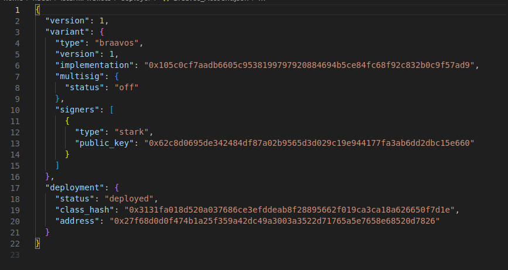
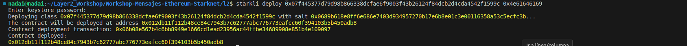

<div align="center">

  <h1 style="font-size: larger;">
  <strong> Workshop de Cero a Héroe:</strong>
   <br/>
  <strong> SEED Latam-Layer 2 en Español-StarknetEs </strong> 
   
  </h1>
    
    
    
    <br/><br/>


<a href="https://www.youtube.com/live/xw9zuXyrStE?si=4QtHcuT7qb399JLX">

</a>
<a href="https://www.youtube.com/live/xw9zuXyrStE?si=4QtHcuT7qb399JLX">

</a>
<a href="https://www.youtube.com/live/xw9zuXyrStE?si=4QtHcuT7qb399JLX">

</a>
<a href="https://www.youtube.com/live/xw9zuXyrStE?si=4QtHcuT7qb399JLX">

</a>
    <br/><br/>
</a>
<a href="https://twitter.com/SEEDLatam">

</a>
<a href="https://twitter.com/Layer2es">

</a>
<a href="https://twitter.com/StarkNetEs">

</a>
    <br/><br/>
<a href="https://github.com/Layer2es">

<a href="https://github.com/Starknet-Es">

<a href="https://github.com/Layer2es/Workshop-Mensajes-Ethereum-Starknet">

</a>


</div>

## Recursos oficiales

- [Starknet Doc](https://docs.starknet.io/documentation/) - Documentos oficiales de Starknet
- [Starknet Book](https://book.starknet.io/) - Libro de Starknet
- [Cairo Doc](https://www.cairo-lang.org/docs/) - Documentos oficiales de de Cairo
- [Libro Cairo](https://cairo-book.github.io/) - Libro de Cairo
- [Libro L2 en Español](https://layer2es.github.io/Book-Starkware/) - Libro escrito por el equipo de L2 en Español sobre el ecosistema de Starknet, Criptografía Básica y temas más profundos de la arquitectura y en general de Starknet.
- [Sintaxis Cairo by Nethermind](https://github.com/NethermindEth/CairoByExample/) | [Sintaxis Cairo by LambdaClass](https://github.com/lambdaclass/cairo-by-example/) | [Starklings](https://github.com/shramee/starklings-cairo1) | [CairoPractice](https://cairopractice.com/) - Colecciones de ejemplos y tutoriales interactivos de aprendizaje en Cairo. 
- [Stark Utils](https://www.stark-utils.xyz/) - Herramienta para convertir tus valores de Cairo, convierte `felt`, `hex`, `string`, `selector`...

---

## Temas 

- [Pre-requisitos](#pre-requisitos)
 - [Git](#git)
 - [Curl](#curl)
 - [Clonado Repositorio](#clonado-repositorio)
- [Instalación de Starkli](#instalación-de-starkli)
- [Instalación de Scarb](#instalación-de-scarb)
- [Instalación de Dojo y Katana](#instalación-de-dojo-y-katana)
- [Conseguir Faucet](#conseguir-faucet)
- [Crear Contrato de Cuenta y Firmantes](#crear-contrato-de-cuenta-y-firmantes)
- [Creación de Firmantes con Starkli](#creación-de-firmantes-con-starkli)      
    - [Opción A: Crear Cuenta, Firmante y Descriptor de Cuenta con OZ](#opción-a-crear-cuenta-firmante-y-descriptor-de-cuenta-con-oz)
    - [Opción B: Crear Cuenta, Firmante y Descriptor de Cuenta con Argent o Braavos](#opción-b-crear-cuenta-firmante-y-descriptor-de-cuenta-con-argent-o-braavos)
- [Integrando Scarb en tu Flujo de Desarrollo](#integrando-scarb-en-tu-flujo-de-desarrollo)
    - [Gestión de Dependencias](#gestión-de-dependencias)
    - [Extensión Cairo VS Code](#extensión-cairo-vs-code)
    - [Compilación de Contratos](#compilación-de-contratos)
    - [Configuración de Variables de Entornos](#configuración-de-variables-de-entornos)
    - [Declarar Contrato Hola.cairo con Starkli](#declarar-contrato-holacairo-con-starkli)
    - [Despliegue del Contrato Hola.cairo con Starkli](#despliegue-del-contrato-holacairo-con-starkli)
- [Katana](#katana)
    - [Declaración y despliegue de Owner.cairo](#declaración-y-despliegue-de-ownercairo)
    - [Interacción con contratos en Katana](#interacción-con-contratos-en-katana)
- [Workshop de Mensajes L2<->L1](#workshop-de-mensajes-l2-l1)
    - [Remix: Compilando y Desplegando](#remix-compilando-y-desplegando)
    - [Manejos de Mensajes enviados y consumirlos](#manejos-de-mensajes-enviados-y-consumirlos)
    - [Desplegando e Interactuando con WorkshopMensajesL2.cairo](#desplegando-e-interactuando-con-workshopmensajesl2cairo)
- [Gestión de Dependencias Externas en Scarb](#gestión-de-dependencias-externas-en-scarb)
- [Comandos Starkli](#comandos-starkli)
- [RPC](#rpc)
- [MIN Deploy](#min-deploy)
   

---

## Pre-requisitos
Antes de empezar, asegúrese de tener instalados los siguientes pre-requisitos en su sistema:

### Git
[Git:](https://git-scm.com/) Será necesario tener `Git` instalado. A continuación, se muestra el comando para instalar `Git` en Ubuntu. Recuerda verificar las versiones disponibles para tu sistema operativo en el enlace proporcionado:

```bash
apt-get install git
```

Si se produce un error y te solicita entrar como administrador, agrega `sudo` al principio del comando. Se abrirá una ventana para ingresar tu contraseña (que será invisible) y luego puedes presionar Enter para continuar.

```bash
sudo apt-get install git
```

### Curl
El procedimiento para instalar `cURL` en Ubuntu Linux es el siguiente:

- Actualiza tu sistema Ubuntu ejecutando: 

```bash
sudo apt update && sudo apt upgrade
```

- A continuación, instala cURL ejecutando: 

```bash
sudo apt install curl
```

- Verifica la instalación de cURL en Ubuntu ejecutando:

```bash
curl --version
```


## Clonado Repositorio
Ahora podrá proceder a hacer un `clone` de nuestro repositorio para obtener toda la configuración y contratos preparados para compilar y deplegar, para ello deberá pasar el comando:

```bash
git clone git@github.com:Layer2es/Workshop-Mensajes-Ethereum-Starknet.git
```

## Instalación de Starkli
[Starkli](https://book.starkli.rs/introduction) es una interfaz de línea de comandos que te permite interactuar con Starknet. Esta es una de las herramientas que nos permite interactuar con Starknet, sin embargo, no es la única. 
Starkliup es el instalador del entorno Starkli, y se puede instalar fácilmente utilizando la línea de comando con curl:

```bash
curl https://get.starkli.sh | sh
```


Puede que necesites reiniciar tu sesión de shell para que el comando starkliup esté disponible. Una vez que esté disponible, ejecuta el comando starkliup:

```bash
starkliup
```

Starkliup detecta la plataforma de tu dispositivo y descarga automáticamente el binario precompilado adecuado. También configura las autocompletaciones de la shell. Es posible que necesites reiniciar tu sesión de shell para que las autocompletaciones comiencen a funcionar.

Ejecutar estos comandos instalará starkli para ti y lo actualizará a la última versión si ya está instalado.


Reinicie el terminal y ejecute el siguiente comando para verificar la instalación:

```bash
starkli --version
```


**Para actualizar a la última versión de Starkli, simplemente siga los pasos anteriores nuevamente.**

---

## Instalación de Scarb
[Scarb](https://docs.swmansion.com/scarb/) es el administrador de paquetes para Cairo. Entre otras cosas, nos permite compilar código Cairo a Sierra, el lenguaje intermedio entre el Cairo de alto nivel y el ensamblador Cairo de bajo nivel (CASM). Para usuarios de macOS y Linux, abra su terminal y ejecute el siguiente comando:

```bash
curl --proto '=https' --tlsv1.2 -sSf https://docs.swmansion.com/scarb/install.sh | sh
```


Reinicie el terminal y ejecute el siguiente comando para verificar la instalación:

```bash
scarb --version
```


Puede ejecutar el mismo comando para actualizarlo o directamente añadir la versión manual de la versión que necesite de [aquí](https://github.com/software-mansion/scarb/releases)

```bash
curl --proto '=https' --tlsv1.2 -sSf https://docs.swmansion.com/scarb/install.sh | sh -s -- -v 2.4.0-rc6
```


Ejecute el siguiente comando para verificar su nueva versión, está vez la `2.4.0-rc6`:

```bash
scarb --version
```


---


Si bien se proporciona esta información para aquellos que deseen instalar una versión específica, se recomienda encarecidamente la instalación de la versión estable utilizando el primer comando o siempre verificar las compatibilidades de las versiones del compilador [aquí](https://github.com/software-mansion/scarb/releases).

Para aprovechar al máximo esta potente combinación de herramientas para Starknet y Cairo, ahora puede confirmar si tanto `Scarb` como `Starkli` están instalados y listos. Hemos configurado estas versiones como las más estables y actualizadas para esta guía:


```bash
scarb --version 
starkli --version 
```


---

## Instalación de Dojo y Katana
Katana, creada por el equipo de Dojo, está diseñada para facilitar el desarrollo local. Esta herramienta permite realizar todas las actividades relacionadas con Starknet en un entorno local, lo que la convierte en una plataforma eficiente para el desarrollo y las pruebas.

Para instalar este entorno local, necesitaremos instalar Dojo con el siguiente comando:

```bash
curl -L https://install.dojoengine.org | bash
dojoup
```


Una vez instalado `katana`, podemos verificar su versión con el siguiente comando:

```bash
katana --version
```


Con `katana`, tenemos la opción de levantar este nodo local para interactuar con él. Aunque `katana` por sí solo debería ser suficiente, recomendamos ejecutarlo con la opción `--disable-fee` para evitar problemas de costes de gas por transacción. En este ejemplo, configuramos `katana` para lanzar solo `3 cuentas` en lugar de las `10 cuentas` predeterminadas:

```bash
katana --disable-fee --accounts 3
```

Si todo ha funcionado correctamente, `Katana` debería estar activo y listo para ser configurado con diversas opciones. Se integra perfectamente con el flujo de trabajo de otras herramientas como starkli.


---

### Conseguir Faucet
Aquí hay varios enlaces y métodos que le proporcionaremos para que pueda desplegar su contrato de cuenta. En este caso, utilizaremos la red de prueba de `Goerli` en Starknet, aunque a finales del 2023 será deprecada y se recomienda empezar a usar `Sepolia` siguiendo el mismo proceso, en estas redes de prueba podrá recibir fondos ETH de varias maneras:

1. **Desde un Faucet de Starknet:** Puede obtener fondos ETH de forma gratuita en la red Goerli de Starknet utilizando el [Faucet Starknet](https://faucet.goerli.starknet.io/).

2. **A través de Starkgate Bridge L1-L2:** También puede transferir fondos desde la capa 1 (L1) de Ethereum en Goerli a la capa 2 (L2) de Starknet utilizando el [Starkgate Bridge L1-L2](https://goerli.starkgate.starknet.io/).

3. **Depositando ETH desde otra dirección:** Tienes la opción de depositar ETH en su contrato de cuenta desde otra dirección de prueba de Starknet o cualquier otra billetera compatible con la red de prueba.

---

## Crear Contrato de Cuenta y Firmantes
Las billeteras inteligentes en Starknet se componen de dos elementos: un `firmante` y un `descriptor de cuenta`. Estos elementos son esenciales para interactuar con Starknet, permitiendo firmar transacciones y proporcionando información relevante sobre la billetera inteligente.

- El `firmante` es un contrato inteligente capaz de firmar transacciones, cuya clave privada es necesaria para su creación.
- El `descriptor de cuenta` es un archivo JSON que contiene información crítica sobre la billetera inteligente, como su dirección y clave pública.

Usaremos 2 opciones para crear nuestra cuenta:

- **Opción A:** Configuraremos nuestro entorno de desarrollo utilizando las lógicas de OZ (OpenZeppelin) y Starknet para crear un nuevo Contrato de Cuenta.

- **Opción B:** Crearemos la cuenta a través de Argent o Braavos, exportando nuestra clave privada.

---

## Creación de Firmantes con Starkli
Starkli emplea `firmantes` o `signers` para autorizar transacciones. Estos pueden ser contratos inteligentes o archivos que almacenan claves privadas. Aquí se presenta cómo crear un firmante utilizando Starkli:

### Opción A: Crear Cuenta, Firmante y Descriptor de Cuenta con OZ

1. **Crear un Firmante:** Utilice Starkli para generar un archivo `keystore` que proteja la clave privada de su billetera inteligente. Para ello, crearemos una carpeta `starkli-wallets/deployer` que podrá encontrar oculta en sus archivos. En `Linux`, puede mostrar archivos ocultos presionando `Ctrl + h`. En este paso se le pedirá una contraseña que podrá añadir o dejar vacía. Por seguridad, **la contraseña permanece oculta**, por lo que no verá en su pantalla su contraseña, pero estará escribiéndola.


    ```bash
    mkdir -p ~/.starkli-wallets/deployer
    starkli signer keystore new ~/.starkli-wallets/deployer/Signer_WorkshopL2.json
    ```

    Esto generará un archivo cifrado llamado `Signer_WorkshopL2.json` (Modifique el nombre del Signer que usted quiera) y lo guardará en la ruta especificada `~/.starkli-wallets/deployer`, además de su `Public Key`.

    


2. **Establecer Variable de Entorno:** Cree una variable de entorno `STARKNET_KEYSTORE` para facilitar la gestión de claves, y ejecútelo en su misma terminal, además deberemos exportar nuestro [RPC](https://github.com/Layer2es/Workshop-Mensajes-Ethereum-Starknet#rpc) que tendrá diversas opciones, recomendamos crearse el suyo con su propia `API KEY` y no depender de públicos, ahora usaremos uno `Open de Blast` para este workshop:

    ```bash
    export STARKNET_KEYSTORE=~/.starkli-wallets/deployer/Signer_WorkshopL2.json
    export STARKNET_RPC="https://starknet-testnet.public.blastapi.io"
    ```

3. **Crear Descriptor de Cuenta:** Crea la cuenta que estará controlada por el `signer` que se ha creado:

    ```bash
    starkli account oz init ~/.starkli-wallets/deployer/Account_WorkshopL2.json
    ```

    Este archivo `Account_WorkshopL2.json` estará en estado `undeployed`, listo para ser desplegado después de recibir saldo.

    

    

4. **Fondear Cuenta:** Nuestro Contrato de Cuenta necesita fondos para cobrar vida, en este caso usaremos el [Faucet](https://faucet.goerli.starknet.io/), puede revisar las otras pociones [aquí](https://github.com/Layer2es/Workshop-Mensajes-Ethereum-Starknet#conseguir-faucet)

    
    
    

5. **Desplegar Cuenta:** Ahora todo está listo para desplegar nuestro Contrato de Cuenta del Estándar de OZ ejecutando el comando `starkli account deploy` con la ruta donde añadimos nuestra Cuenta.

    ```bash 
    starkli account deploy /home/nadai/.starkli-wallets/deployer/Account_WorkshopL2.json
    ```

    Primeramente, se le preguntará si tiene fondos. Una vez confirmado, presione Enter y su cuenta debería ser desplegada. 

    

    Ahora podrá revisar su descriptor de cuenta como ha pasado de `undeployed` a `deployed`. Ya tiene todo listo para empezar a crear sus primeros contratos en Starknet.

    


### Opción B: Crear Cuenta, Firmante y Descriptor de Cuenta con Argent o Braavos

1. **Crear Billetera Inteligente**: Siga las instrucciones proporcionadas por las extensiones del navegador [Braavos](https://braavos.app/download-braavos-wallet/) o [Argent X](https://www.argent.xyz/argent-x/) para crear una billetera inteligente.

2. **Exportar Clave Privada**: Exporte la clave privada desde la configuración de su cuenta en Braavos o Argent X, en este Workshop hemos usado Braavos. 

    * **Para Argent X:** Puede encontrarla en la sección "Configuración" → Seleccione su cuenta → "Exportar clave privada".
    * **Para Braavos:** Puede encontrarla en la sección "Configuración" → "Privacidad y seguridad" → "Exportar clave privada".

    
    


3. **Cree un firmante:** Con Starkli y utilizando la clave privada que tendrá que añadir, más un password si quiere añadir una contraseña para su seguridad, esto configurará su Contrato de Cuenta desde Argent o Braavos, para ello creemos el `signer` con el siguiente comando:

    ```bash
    starkli signer keystore from-key ~/.starkli-wallets/deployer/Signer_Braavos.json
    ```

    

    Con esta parte, habremos configurado nuestro firmante, y a continuación, definiremos cómo utilizaremos nuestro Contrato de Cuenta creando un Descriptor de Cuenta con la información necesaria.

3. **Crear Descriptor de Cuenta**: Crea la cuenta que estará controlada por el `signer` que se ha creado, pero primero deberemos exportar un punto de RPC para que pueda conseguir los datos de nuestro contrato de cuenta para crear el Descriptor usando el siguiente comando:

    ```bash
     export STARKNET_RPC="https://starknet-testnet.public.blastapi.io"
    ```

    Ahora podremos pasar el comando con la dirección de nuestra cuenta de Braavos o Argent para crear nuestro Descriptor de Cuenta:

    ```bash
    starkli account fetch 0x027f68d0d0f474b1a25f359a42dc49a3003a3522d71765a5e7658e68520d7826 --output ~/.starkli-wallets/deployer/Account_Braavos.json
    ```

    

    Esto nos dará nuestro archivo `.json` con toda la información relevante para poder usar nuestra cuenta recien exportada.

    

---

Con estas 2 opciones conseguimos tener nuestra cuenta exportada e integrada en nuestro flujo de trabajo para desarrollar con ellas.

Acceda directamente [aquí](https://github.com/Layer2es/Workshop-Mensajes-Ethereum-Starknet#variables-de-entorno) si quiere ir directamente a diversas formas de trabajar con las variables de entorno de la forma que vea más útil.

---

## Integrando Scarb en tu Flujo de Desarrollo
Estos pasos te guiarán a través de un flujo de trabajo típico para desarrollar un contrato Starknet utilizando Scarb. Si has clonado este repositorio y quieres seguir solo los procesos, puedes ir directamente al paso 5.

1. **Inicialización del Proyecto:** Comienza ejecutando `scarb new workshop` para crear un nuevo proyecto con el nombre "workshop". Este comando generará automáticamente la estructura básica del proyecto, incluyendo un archivo de configuración `Scarb.toml` y un archivo inicial `src/lib.cairo`.

2. **Desarrollo del Contrato:** Escribe tu código Cairo y guárdalo en el directorio `src`. En este caso, utilizaremos como base varios contratos: `Hola.cairo`, `Owner.cairo` y el contrato `WorkshopMensajesL2.cairo`.

3. **Optimización de Módulos:** Utilizaremos el archivo `lib.cairo` para añadir los módulos `mod Hola`, `mod Owner` y `mod WorkshopMensajesL2`, que indicarán qué contratos de Cairo se utilizarán.

4. **Gestión de Dependencias:** Si tu contrato depende de bibliotecas externas, usa `scarb add` para incluir fácilmente estas dependencias en tu proyecto, incluso de una versión específica. Además, puedes utilizar `scarb rm` para eliminarlas. Por ejemplo:

    ```bash
    scarb add alexandria_math --git https://github.com/keep-starknet-strange/alexandria.git --rev 27fbf5b
    ```

    Eliminar:

    ```bash
    scarb rm alexandria_math
    ```

5. **Compilación del Contrato:** Ejecuta `scarb build` para compilar tu contrato en código Sierra. Este código resultante puede ser examinado con más detalle o utilizado como entrada para otras herramientas o procesos.

Integrar Scarb en tu flujo de trabajo te permite aprovechar sus características para hacer tu proceso de desarrollo más eficiente y manejable.

---

### Gestión de Dependencias
Una vez hayas copiado los pasos anteriores de este taller, deberás guardar todos los cambios en tu editor de código y proceder a modificar tu archivo `Scarb.toml`. En la sección `[dependencies]`, podrás añadir dependencias externas como por ejemplo las de OpenZeppelin u otras que necesites. Además, asegúrate de que en la sección `[[target.starknet-contract]]` de tu archivo `Scarb.toml` especifiques `sierra = true` para que la compilación genere el código en la representación intermedia de Sierra en formato `.json`.

Es importante señalar que si no indicas `sierra = true` en la sección correspondiente, la compilación generará el código en formato `casm`, que es una versión cruda de Cairo. Dado que necesitamos la representación intermedia de Sierra para que el contrato sea más legible y tenga propiedades de seguridad, es esencial habilitar esta opción.

Tu archivo [`Scarb.toml`](/Workshop-Mensajes-Ethereum-Starknet/l2/Scarb.toml) utilizado para este Workshop será:

```toml
[package]
name = "workshop_l2"
version = "1.0.0"
cairo-version = "2.3.1"
authors = ["L2 Español, SEED Latam, StarknetEs - Starknet"]
description = "Workshop de 0 a Heroe. Envio de mensajes entre Ethereum <-> Starknet"

[dependencies]
starknet = ">=2.3.1"

[[target.starknet-contract]]
sierra = true
```

---

### Extensión Cairo VS Code 
Para trabajar con la sintaxis de Cairo de manera efectiva y detectar automáticamente la versión del compilador, así como facilitar la corrección de errores, es altamente recomendable utilizar la extensión `Cairo 1` en VS Code. Siga estos pasos para configurarla:

1. Abra Visual Studio Code.

2. Diríjase a la sección de extensiones. Puede hacerlo haciendo clic en el ícono de `Extensiones` en la barra lateral izquierda o presionando `Ctrl + Shift + X`.

3. En la barra de búsqueda de extensiones, escriba `Cairo 1`.

4. Aparecerá la extensión `Cairo 1`. Haga clic en `Instalar` para descargarla e instalarla en su entorno de VS Code.

5. Una vez que la extensión esté instalada, podrá detectar automáticamente la versión del compilador Cairo a partir del archivo de manifiesto de su proyecto `Scarb`. Asegúrese de tener `Scarb` instalado correctamente. También puede configurar su activación desde los ajustes revisando el estado activo de las casillas `Cairo1: Enable Scarb`, o en caso de que siga teniendo problemas después de reiniciar, añadir las rutas del paquete binario de Scarb en `Cairo1: Scarb Path`.


Esto facilita la corrección de errores y asegura que su código se ajuste a la versión específica del compilador.

Con la extensión `Cairo 1` configurada en su entorno de Visual Studio Code, estará listo para trabajar de manera eficiente con la sintaxis de Cairo y aprovechará las funciones de detección de errores y corrección automática proporcionadas por la extensión. Esto es especialmente útil para desarrollar aplicaciones en Cairo de manera más efectiva y sin problemas.

---

### Compilación de Contratos
Ahora procederemos a compilar nuestros contratos definidos en [`lib.cairo`](/Workshop-Mensajes-Ethereum-Starknet/l2/src/lib.cairo), en este caso recordamos que será un [`Hola.cairo`](/Workshop-Mensajes-Ethereum-Starknet/l2/src/Hola.cairo), el [`Owner.cairo`](/Workshop-Mensajes-Ethereum-Starknet/l2/src/Owner.cairo) y el [`WorkshopMensajesL2.cairo`](/Workshop-Mensajes-Ethereum-Starknet/l2/src/WorkshopMensajesL2.cairo). Si ha clonado este repositorio (recuerde que puede hacerlo con el comando `git clone git@github.com:Layer2es/Workshop-Mensajes-Ethereum-Starknet.git`), tendremos que entrar en la carpeta de `Workshop-Mensajes-Ethereum-Starknet/l2` en la que se encontrarán los contratos de Cairo y le bastará con ejecutar un comando para llevar a cabo la compilación:

```bash
scarb build
```


Si todo ha ido bien, se debería crear una carpeta `dev/target` que contendrá los archivos `workshop_l2_hola.contract_class.json`, `workshop_l2_Ownable.contract_class.json` y `workshop_l2_WorkshopMensajesL2.contract_class.json` más un archivo con los `artifacts`. Aunque nos centraremos en `Hola.cairo`, podría realizar la misma acción para el resto, estos archivos en versión Sierra con terminación en `.json`, son los que necesitaremos para llevar a cabo las operaciones de `Declare` y `Deploy` Si, por cualquier motivo, no se genera este archivo, puede intentar borrar la carpeta `target` y luego volver a ejecutar el comando `scarb build`.


---

### Configuración de Variables de Entornos
Una vez tengamos todo preparado realizaremos la declaración del `Hola.cairo`, está declaración nos servirá para establecer una estrucutra que nos sirva para usar en el futuro y si queremos volver a usar este contrato, solo usar su mismo `Class Hash` que nos ha dado, y pasar los argumentos del construcutor que queremos, asi podrimaos tener un `Class hash` por ejemplo de un `ERC-20` standard o con ciertas propiedades, pero cada uno con su owner, nombre, simbolo, total supply o diferentes lógicas que sean  programadas.

Siempre es importante verificar que los `EXPORT` se hayan realizado correctamente para interactuar con la red de Starknet, podemos definir 3 maneras útiles para manejar nuestras variables de entorno necesarias.

1. Manual:

Deberemos definir cada vez que habramos la terminal el `keystore` o firmante que tengamos añadido, el `account` o contrato de cuenta que vamos a utilizar y el `rpc` que podremos definir uno propio y manejar los diferentes puntos de conexión a las redes `mainnet`, `goerli`, o `sepolia`.

```bash
export STARKNET_KEYSTORE=~/.starkli-wallets/deployer/Signer_WorkshopL2.json
export STARKNET_ACCOUNT=~/.starkli-wallets/deployer/Account_WorkshopL2.json
export STARKNET_RPC="https://starknet-testnet.public.blastapi.io"
```

Ejemplos que puede usar para cada una de sus cuentas `Workshop con OZ`, `Katana` o `Braavos`, en este caso indicamos un `API KEY` propioi creado en [Infura](https://www.infura.io/), pero recuerde revisar todas las posibilidades en [Sección de RPC](https://github.com/Layer2es/Workshop-Mensajes-Ethereum-Starknet#rpc)

```bash
export STARKNET_ACCOUNT=~/.starkli-wallets/deployer/Account_WorkshopL2.json
export STARKNET_KEYSTORE=~/.starkli-wallets/deployer/Signer_WorkshopL2.json
export STARKNET_RPC="https://starknet-goerli.infura.io/v3/6e7788ff3c784159993c45a949172f0e"
```

**Variables de Entorno de Starknet Braavos/Argent** 

```bash
export STARKNET_ACCOUNT=~/.starkli-wallets/deployer/Account_Braavos.json
export STARKNET_KEYSTORE=~/.starkli-wallets/deployer/Signer_Braavos.json
export STARKNET_RPC="https://starknet-goerli.infura.io/v3/6e7788ff3c784159993c45a949172f0e"
```

**Variables de Entorno de Katana**

```bash
export STARKNET_ACCOUNT=~/.starkli-wallets/deployer/AccountKatana_Workshop.json
export STARKNET_KEYSTORE=~/.starkli-wallets/deployer/SignerKatana_Workshop.json
```

2. Archivo bash:

La otra opción es crear un archivo envars que gestione nuestros `keystore`, `account` y `rpc`, lo ideal sería en la raíz de donde hemos creado nuestras cuentas de `OZ` la de `Braavos` o la de `Katana` crear un envars.sh, en este caso utilizaremos [`envarsWorkshop.sh`](/Workshop-Mensajes-Ethereum-Starknet/l2/envars/envarsWorkshop.sh) aunque dejaremos al final la configuración de todas ellas, podrá encontrarlas en el repo [aquí](/Workshop-Mensajes-Ethereum-Starknet/l2/envars/). 

Deberemos crear primero el archivo:

```bash
touch ~/.starkli-wallets/deployer/envarsWorkshop.sh
```

Ahora podremos editarlo y añadir nuestras variables:

```bash
#!/bin/bash
export STARKNET_ACCOUNT=~/.starkli-wallets/deployer/Account_WorkshopL2.json
export STARKNET_KEYSTORE=~/.starkli-wallets/deployer/Signer_WorkshopL2.json
export STARKNET_RPC="https://starknet-testnet.public.blastapi.io"
```

Todo listo para activar nuestras variables, sólo tendremos que ejecutar el comando llamando al archivo con la configuración que queramos usar:

```bash
source ~/.starkli-wallets/deployer/envarsWorkshopL2.sh
```

Ejemplos que puede usar para cada una de sus cuentas `Workshop con OZ`, `Katana` o `Braavos`

```bash
touch ~/.starkli-wallets/deployer/envarsKatana.sh
touch ~/.starkli-wallets/deployer/envarsBraavos.sh
touch ~/.starkli-wallets/deployer/envarsWorkshop.sh
```

**Katana**

```bash
#!/bin/bash 
export STARKNET_ACCOUNT=~/.starkli-wallets/deployer/AccountKatana_Workshop.json 
export STARKNET_KEYSTORE=~/.starkli-wallets/deployer/SignerKatana_Workshop.json
export STARKNET_RPC=http://0.0.0.0:5050
```

**Braavos**

```bash
#!/bin/bash
export STARKNET_ACCOUNT=~/.starkli-wallets/deployer/Account_Braavos.json
export STARKNET_KEYSTORE=~/.starkli-wallets/deployer/Signer_Braavos.json
export STARKNET_RPC="https://starknet-goerli.infura.io/v3/6e7788ff3c784159993c45a949172f0e"
```

**OpenZeppelin**

```bash
#!/bin/bash
export STARKNET_ACCOUNT=~/.starkli-wallets/deployer/Account_Workshop.json
export STARKNET_KEYSTORE=~/.starkli-wallets/deployer/Signer_Workshop.json
export STARKNET_RPC="https://starknet-goerli.infura.io/v3/6e7788ff3c784159993c45a949172f0e"
```

```bash
source ~/.starkli-wallets/deployer/envarsKatana.sh
source ~/.starkli-wallets/deployer/envarsBraavos.sh
source ~/.starkli-wallets/deployer/envarsWorkshop.sh
```

3. Env:

También hemos dejado unos [`.env.example`](/Workshop-Mensajes-Ethereum-Starknet/l2/.env.example) que definiran `.env` si quiere utilizar este método, recordamos que los `.env` no son subidos a github y permaneceran seguros en ese archivo.

Deberemos crear primero nuestro archivo `.env` escogiendo el example deseado, en este caso seguiremos con example con la configuración del account de `Workshop`, para ello ejecutaremos el siguiente comando:

```bash
cp .env.example .env
source .env
```

---

### Declarar Contrato Hola.cairo con Starkli
Si nos encontramos en la carpeta raíz de nuestro proyecto, tenemos dos opciones: ir directamente a nuestra carpeta `dev` y ejecutar `declare` con `starkli`:

```bash
starkli declare workshop_l2_hola.contract_class.json
```

O indicar directamente la ubicación de nuestro archivo:

```bash
starkli declare ./target/dev/workshop_l2_hola.contract_class.json
```

Si recibes algún error, revisa si se debe a la falta de encontrar el archivo, lo que indicaría un error en la ruta o el nombre. También verifica si al abrir una nueva terminal olvidaste exportar las variables de entorno necesarias o ingresaste incorrectamente tu contraseña.

El resultado esperado incluye datos como la red utilizada, la versión de compilación, el hash de la transacción y la compilación a Sierra desde Casm. Esto generará un `Class hash` que debemos guardar para nuestro despliegue. También puede indicar que tu `class` ya ha sido declarada.


En este ejemplo, usaremos `Class hash declared: 0x07f445377d79d98b866338dcfae6f9003f43b26124f84dcb2d4cda4542f1599c`, el cual ya ha sido declarado.

---

### Despliegue del Contrato Hola.cairo con Starkli
Ahora que hemos declarado nuestro contrato, si no se había hecho anteriormente y es único, podemos omitir la declaración y proceder directamente al despliegue. Para ello, debemos asegurarnos de revisar los argumentos que se pasan al constructor del contrato. En primer lugar, debemos proporcionar el `Class hash` del contrato que queremos desplegar, en este caso será `0x07f445377d79d98b866338dcfae6f9003f43b26124f84dcb2d4cda4542f1599c`. 

Además, en el constructor (en caso de que lo haya) debemos revisar los argumentos que necesitamos para desplegar nuestro contrato, en este caso sólo necesitamos un `Nombre` que queramos guardar en nuestro `storage` del contrato para el `Hola.cairo` pero debemos revisar cada constructor para el resto de contratos de `Owner.cairo` y `WorkshopMensajesL2.cairo` 

Aquí revisamos este caso concreto que necesita el constructor:

```rust
    #[constructor]
    fn constructor(ref self: ContractState, name: felt252) {
        self.name.write(name);
    }
```

Para pasar nuestro nombre que queramos guardar a `felt` o a `hexa` podemos utilizar el comando de Starkli y añadir el string, en este caso pondremos `Nadai`: 

```bash
starkli to-cairo-string Nadai
```


Y vemos que la salida convertida que deberemos pasar es `0x4e61646169`. También podemos utilizar la herramienta [Stark.utils](https://stark-utils.vercel.app/converter) para hacer la conversión. Por lo tanto, ejecutamos el siguiente comandos y añadimos los argumentos requeridos:


```bash
starkli deploy 0x07f445377d79d98b866338dcfae6f9003f43b26124f84dcb2d4cda4542f1599c 0x4e61646169
```



Puedes consultar el [enlace del contrato del "Hola"](https://testnet.starkscan.co/contract/0x012db11f112b48ce84c7943b7c62777abc776773eafcc60f394103b5b450adb8#read-write-contract) para asegurarte de que todo esté correcto y que se guardado el nombre de `Nadai` para ello podemos revisar la función de read `obtener_nombre`, que deberá dar la data recién guardada.


Además, con Starkli, puedes realizar llamadas directas al contrato para verificar que todo esté en orden indicando `call` seguido del `contract` y el nombre del `selector`, en este caso el selectro que vamos a llamar es `obtener_nombre`:

```bash
starkli call 0x012db11f112b48ce84c7943b7c62777abc776773eafcc60f394103b5b450adb8 obtener_nombre
```


Podemos convertir este valor de nuevo a un string que deberá dar el nombre de `Nadai`, utilizando [Stark.utils](https://stark-utils.vercel.app/converter) o con Starkli y el comando:

```bash
starkli parse-cairo-string 0x0000000000000000000000000000000000000000000000000000004e61646169
```


Ahora para finalizar haremos un `invoke`, el cual modificará el estado del contrato y por lo tanto de la red, para ello escogemos un nuevo `Name`, usaremos `L2enEspanol` para convertirlo, usando el comando anterior:

```bash
starkli to-cairo-string L2enEspanol
```


Ahora pasaremos el valor `0x4c32656e457370616e6f6c` como argumento con el comando de Starkli `invoke` en el cual deberemos indicar el `contract`, el nombre del `selector`, en este caso el selector que vamos a llamar es `escoger_nombre` seguido del nuevo nombre:

```bash 
starkli invoke 0x012db11f112b48ce84c7943b7c62777abc776773eafcc60f394103b5b450adb8 escoger_nombre 0x4c32656e457370616e6f6c
```


Y podemos comprobar con el comando anterior para `obtener_nombre` que el estado del contrato ha sido cambiado correctamente:

```bash
starkli call 0x02edd5e8f285ef73e78fcdb46e667e2d3a47b960e0575c1b6c2a5b4d91c6b0f3 obtener_nombre
```


También podemos revisar en los explorer que todo ha sido actualizado y la invoación a la función `escoger_nombre` está funcionando correctamente.


---

## Katana
Ahora con Katana, configuraremos un Owner. Podríamos usar un keystore similar al de las otras cuentas. Primero, accederemos a `katana`. Tenemos la opción de levantar este nodo local para interactuar con él. Recomendamos ejecutarlo con la opción `--disable-fee` para evitar problemas de costos de gas por transacción. En este ejemplo, configuraremos `katana` para lanzar solo `3 cuentas`, en lugar de las `10 cuentas` predeterminadas. Luego, dividiremos la terminal en dos para continuar.

```bash
katana --disable-fee --accounts 3
```


Una vez levantado Katana, configuramos nuestra cuenta de Katana como un signer y establecemos las cuentas que han sido pre-desplegadas para usarlas en este entorno. También creamos nuestro descriptor de cuenta:

```bash
starkli signer keystore from-key ~/.starkli-wallets/deployer/SignerKatana_Workshop.json
```


Luego, utilizamos las variables de diferentes maneras, ya sea mediante `env`, un archivo `envars`, o bien configurándolas manualmente:

```bash
export STARKNET_ACCOUNT=~/.starkli-wallets/deployer/AccountKatana_Workshop.json
export STARKNET_KEYSTORE=~/.starkli-wallets/deployer/SignerKatana_Workshop.json
```

---

### Declaración y despliegue de Owner.cairo
Pasamos a declarar y desplegar nuestro contrato [Owner.cairo](/Workshop-Mensajes-Ethereum-Starknet/l2/src/Owner.cairo). Después de haber ejecutado `scarb build`, estamos listos para el `declare` y `deploy`, debiendo indicar el `rpc de katana`:

```bash
starkli declare target/dev/workshop_l2_Ownable.contract_class.json --rpc http://0.0.0.0:5050 --account ~/.starkli-wallets/deployer/AccountKatana_Workshop.json --keystore ~/.starkli-wallets/deployer/SignerKatana_Workshop.json
```


Luego, indicamos el `Class hash` del contrato a desplegar y los argumentos requeridos por `Owner.cairo`. Por ejemplo, una dirección de quien será el propietario, como una de las cuentas de Katana que no haya sido utilizada.

```bash
starkli deploy 0x0539a4c86c5f2a93977c227d2ff7777ec895418961b824b5cb1ad3eadce9b0e3 0x5686a647a9cdd63ade617e0baf3b364856b813b508f03903eb58a7e622d5855 --rpc http://0.0.0.0:5050 --account ~/.starkli-wallets/deployer/AccountKatana_Workshop.json --keystore ~/.starkli-wallets/deployer/SignerKatana_Workshop.json
```


---

### Interacción con contratos en Katana
Usamos `Starkli` para realizar `call` y `invoke`, añadiendo el `rpc` y las variables adecuadas. Por ejemplo, para verificar `get_owner`:

```bash
starkli call 0x04bcc6a7571624b8f082507512dbb91e3b380eb138067ff5bf103a72faeaae42 get_owner --rpc http://0.0.0.0:5050
```


Para realizar un `transfer_ownership`, solo necesitamos la dirección del contrato y el nuevo propietario. Antes de ejecutar este comando, es necesario configurar la segunda cuenta que acabamos de hacer propietaria para poder realizar el `invoke` con esa cuenta.

1. **Crear Signer Cuenta 3:**
    ```bash
    starkli signer keystore from-key ~/.starkli-wallets/deployer/SignerKatana3_Workshop.json
    ```

2. **Crear Descriptor y Cuenta 3:**
    ```bash
    starkli account fetch 0x5686a647a9cdd63ade617e0baf3b364856b813b508f03903eb58a7e622d5855 --rpc http://0.0.0.0:5050 --output ~/.starkli-wallets/deployer/AccountKatana3_Workshop.json
    ```
    
Una vez configurada, hacemos el `invoke` hacia la tercera cuenta de Katana, por ejemplo:

```bash
export STARKNET_ACCOUNT=~/.starkli-wallets/deployer/AccountKatana3_Workshop.json
export STARKNET_KEYSTORE=~/.starkli-wallets/deployer/SignerKatana3_Workshop.json
```

```bash
starkli invoke 0x04bcc6a7571624b8f082507512dbb91e3b380eb138067ff5bf103a72faeaae42 transfer_ownership 0x765149d6bc63271df7b0316537888b81aa021523f9516a05306f10fd36914da --rpc http://0.0.0.0:5050 --account ~/.starkli-wallets/deployer/AccountKatana3_Workshop.json --keystore ~/.starkli-wallets/deployer/SignerKatana3_Workshop.json
```


Para verificar que todo ha salido bien, puedes revisar que Katana haya minado tres bloques o transacciones. Además, puedes volver a ejecutar una llamada al contrato usando `starkli call` para confirmar que el `owner` ha cambiado correctamente hacia la nueva cuenta de Katana 3:

```bash
starkli call 0x04bcc6a7571624b8f082507512dbb91e3b380eb138067ff5bf103a72faeaae42 get_owner --rpc http://0.0.0.0:5050
```


----


## Workshop de Mensajes L2<->L1
Este contrato se encarga de recibir mensajes en `L2` provenientes de `L1` y manejar estos datos utilizando el `selector` correspondiente y otros valores que veremos posteriormente. Es esencial indicar al sistema que manejará estas funciones de mensajes con `#[l1_handler]`. Nuestro contrato [`WorkshopMensajesL2.cairo`](/Workshop-Mensajes-Ethereum-Starknet/l2/src/WorkshopMensajesL2.cairo) también puede enviar mensajes desde `L2` hacia `L1` para ser consumidos.

Para comenzar, desplegaremos nuestros contratos [WorkshopMensajesL1.sol](/Workshop-Mensajes-Ethereum-Starknet/l1/src/WorkshopMensajesL1.sol) y [WorkshopMensajesL2.cairo](/Workshop-Mensajes-Ethereum-Starknet/l2/src/WorkshopMensajesL2.cairo). Usaremos [Remix](https://remix.ethereum.org) para desplegar nuestros contratos en Ethereum y en Cairo de manera sencilla.

---

### Remix: Compilando y Desplegando
Comencemos creando un nuevo Workspace en blanco y asignando el nombre deseado, por ejemplo, `Workshop L2 en Español`.


Ahora subiremos la carpeta que hemos clonado del Workshop, la cual contendrá la carpeta `l1` para desplegar nuestro contrato de Solidity en Ethereum y nuestros contratos en Cairo para Starknet.


Luego, procederemos a compilar el proyecto. Deberemos asegurarnos de seleccionar `WorkshopMensajesL1`, compilar y dirigirnos a la sección de despliegue. Aquí deberemos indicar la conexión que utilizaremos; en este caso, `Injected Provider - Metamask` para utilizar una cuenta de Goerli con fondos de faucet. 


Tendremos que indicar los valores que necesita el constructor para desplegar. En este caso, la dirección del Contrato del Starknet Core desplegado en Goerli, que controla y es responsable de todas las syscall. La dirección en Goerli de Ethereum es `0xde29d060D45901Fb19ED6C6e959EB22d8626708e`.


Una vez confirmada la transacción, nuestro contrato estará desplegado. Para interactuar con él desde el Explorador, deberemos verificar este contrato. Podemos bajarnos el plugin de `Contract verification - Etherscan`, pero primero necesitaremos crearnos una `API KEY` para poder verificarlo correctamente.

**También pueden usar el contrato desplegado [aquí](https://goerli.etherscan.io/address/0xf2dcf405fe5ce4000f1637e9b65ac6f7416e43a0) si no consiguen Verificarlo.**

Para verificar con la API KEY, primero tendremos que crear una desde [Etherscan](https://etherscan.io/). Crea una cuenta, inicia sesión y accede a la pestaña de tu perfil y `Api Key`.


Simplemente presiona `Add` y crea una nueva con el nombre que desees, luego copia tu Api Key Token para pegarlo en Remix y poder verificar tu Contrato.


A veces, la verificación básica puede causar problemas. Para prevenirlo, prueba en Remix antes de verificar crear un `flatten` del contrato `WorkshopMensajeL1.sol`.


Podrás verificar que tu contrato no esté verificado previamente y que no puedas modificarlo ni acceder a sus funciones desde el explorador. Una vez ingreses al plugin de Verificación, en el ícono `Home`, se te pedirá tu `Api Key Token`. Después de agregarlo, selecciona los argumentos del constructor `0xde29d060D45901Fb19ED6C6e959EB22d8626708e` y la dirección del Contrato desplegado, en nuestro caso `0xF2dcF405fE5cE4000F1637e9B65aC6F7416e43A0`.


---

### Desplegando e Interactuando con WorkshopMensajesL2.cairo

A pesar de que podríamos seguir utilizando Remix para desplegar Workshop Mensajes L2, nos enfocaremos en la CLI para practicar. Utilizaremos la cuenta de Braavos para llevar a cabo este proceso.

Primero, configuramos las variables. Aunque dejaremos las variables aquí para configurarlas manualmente, recuerda que existen diversos métodos para gestionarlas.

```bash
export STARKNET_ACCOUNT=~/.starkli-wallets/deployer/Account_Braavos.json
export STARKNET_KEYSTORE=~/.starkli-wallets/deployer/Signer_Braavos.json
export STARKNET_RPC="https://starknet-goerli.infura.io/v3/6e7788ff3c784159993c45a949172f0e"
```

Dentro de la carpeta `l2`, ejecutamos `scarb build`. En el comando `declare`, indicamos el contrato `WorkshopMensajesL2` en formato `.json` en Sierra.

```bash
starkli declare ./target/dev/workshop_l2_WorkshopMensajesL2.contract_class.json
```


Si no hemos realizado cambios, veremos la notificación de que el contrato ya ha sido declarado. Procedemos al deploy, sin necesidad de argumentos del constructor.

```bash
starkli deploy 0x03ac40c1e3bde07fe4fb81623fdbb72fd1c34a6bcb492712c38997f1adcadea5
```


El contrato de Mensajería de L2 en Cairo está listo para ser utilizado.

* [Contrato Mensajes L1](https://goerli.etherscan.io/tx/0x7bc724e0f30cb79a5f75a29a065822f029cf13a36458f136d3bf4ee1ee81c106)
* [Contrato Mensajes L2](https://testnet.starkscan.co/search/0x0771b629cb3ff29a7af8369a18e02050b2cccd53bcd4594c9d96718dc3edd9ef)


### Manejos de Mensajes enviados y consumirlos
Ahora procederemos a enviar nuestros mensajes entre L1<->L2. Es esencial comprender el manejo de mensajes y sus estados:

#### **De L1 a L2:**
1. **Enviado a L2:** El mensaje es enviado desde L1->L2, donde es recibido y registrado en la red de L2 para su procesamiento posterior.
2. **Consumido en L2:** Una vez recibido en L2, el mensaje es procesado y utilizado por los contratos o la lógica implementada en Starknet.
3. **Finalizado en L1:** Después de haber sido consumido y procesado en Starknet, se informa a la capa 1 sobre la finalización del mensaje, actualizando su estado para reflejar que la acción se ha completado.

#### **De L2 a L1:**
1. **Enviado a L1:** El mensaje es enviado desde L2->L1, listo para ser recibido y procesado por la red de L1.
2. **Adjuntado a L1:** Una vez que el mensaje llega L1, se adjunta a la red para su procesamiento posterior. En este estado, el mensaje está disponible pero aún no ha sido consumido.
3. **Consumido en L1:** Finalmente, el mensaje podrá ser consumido por L1 y su contenido es utilizado según lo previsto en la lógica implementada en esa capa.

Estos estados reflejan cómo los mensajes atraviesan diferentes capas (L1 y L2) y cómo se procesan y utilizan en cada una de ellas hasta su estado finalizado o consumido.

Para enviar mensajes, es necesario tener `#[l1_handler]` indicado para realizar una `syscall` y el selector de la función deseada, como `recibir_mensaje_valor_l1`. Además, el valor enviado desde L1 debe cumplir con condiciones específicas, como la carga útil añadida en `assert(value == 123)`, y especificar `from_address` del contrato de L1 que envía el mensaje (WorkshopMensajesL1).

    ```bash
    #[l1_handler]
    fn recibir_mensaje_valor_l1(ref self: ContractState, from_address: felt252, value: felt252) {
        // assert(from_address == ...);
        // Valor fijo para ser válido == 123

        assert(value == 123, 'Valor inválido');
    }
    ```

Podríamos calcular el selector directamente con un keccak256, pero es más sencillo usar [Stark Utils](https://stark-utils.vercel.app/converter), donde obtendremos el selector en felt. En este caso, usaremos `488620836784764677921038031667344270694842985450521428815152577605510277981`.


Este será el valor del selector que utilizaremos al enviar el mensaje de L1->L2 si queremos utilizar esa función específica. Para ello, debemos ir al contrato desplegado en L1 e indicar los valores correspondientes para [enviar_Mensaje_Starknet](https://goerli.etherscan.io/address/0xf2dcf405fe5ce4000f1637e9b65ac6f7416e43a0#writeContract#F4):

* PayableAmount: Cantidad de ETH a enviar para pagar, que puede ser 0.000001
* ContractAddress: Dirección del Contrato de L2 que recibirá el mensaje (WorkshopMensajeL2.cairo)
* Selector: Función interna en el Contrato de L2 indicada con L1 Handler que queremos utilizar
* Payload: Valor que queremos pasar


* [Transacción de L1 a L2](https://goerli.etherscan.io/tx/0xef828cf44cba2d7420ef383da3a7ec078de4f57d6922204881da14638fc0b908)

Observamos que el mensaje llega casi instantáneamente de L1 a L2 con el estado `Enviado a L2`.


Si todo ha salido bien, no deberás realizar ningún paso adicional. Verificarás que, a medida que avancen los estados de pendiente en L1 o cuando se actualice el estado final en L1, el mensaje habrá pasado por los tres estados correctamente, siempre que el selector y los demás valores sean correctos. Puedes verificar si tu mensaje ha sido consumido en L2, lo que significa que ha interactuado correctamente con el selector, verificando que los hashes sean iguales.


Ahora, para enviar un Mensaje de L2->L1, lo haremos desde nuestro contrato de L2. Deberemos indicar la dirección del contrato con el que interactuaremos en L1, siempre y cuando pueda recibir y enviar mensajes. Una vez el mensaje llegue (puede tardar minutos u horas), podremos consumirlo desde L1.


* [Envío Mensaje de L2->L1](https://goerli.voyager.online/tx/0x68b5e2d1eef973133bd3f7e1b2c99239aa02c8c4406211e096253009b6703c0)

Ahora observaremos la actualización de mensajes enviados desde L2->L1.


Este mensaje no podrá ser consumido hasta que se adjunte a L1. Este paso se realiza manualmente para evitar posibles ataques y garantizar una seguridad de 2FA. Solo nosotros podremos consumir ese mensaje y aceptar lo que conlleva, como un dato de Valor 123.

--- 

## Gestión de Dependencias Externas en Scarb
En Scarb, puedes añadir y gestionar las dependencias desde el archivo `Scarb.toml`. Añadir una dependencia es fácil y se puede hacer de varias maneras, una de ellas es utilizando el comando `scarb add`, que admite una variedad de parámetros para expresar tus dependencias. También puede mantener automáticamente la lista de dependencias ordenada, si no lo está. A continuación, se muestra un ejemplo de cómo agregar una dependencia, como alexandria_math:

```shell
scarb add alexandria_math --git https://github.com/keep-starknet-strange/alexandria.git --rev 27fbf5b
```

Para eliminar una dependencia, simplemente debes eliminar las líneas relacionadas en tu archivo Scarb.toml. Como atajo rápido, puedes utilizar el comando `scarb remove`, también conocido como `scarb rm`, que limpiará automáticamente el manifiesto de dependencias, debes indicar cual quieres eliminar como se muestra aquí:

```shell
scarb rm alexandria_math
```

Con estas herramientas, puedes gestionar tus dependencias de manera eficiente en Scarb y mantener tu proyecto organizado.

---
## Comandos Starkli
### Call
Desde Starkli, puedes cambiar el estado de un contrato, realizar operaciones o hacer consultas a datos y estados de la blockchain. Así que comprobemos si nuestro contrato de `Owner.cairo` tiene la dirección del contrato de la cuenta que hemos añadido. Para ello, debemos realizar una `call` e indicar qué función queremos invocar. Lo bueno de Starknet son los selectores, y en este caso, llamaremos a la función `get_owner` del contrato para obtener información sobre quién es el propietario, en este caso sólo es una `call` que no modifica el estado.

```bash
starkli call 0x028491f9e3d8b0005a649e08833330de371b5e227be05a0e0575f247df8691a5 get_owner
```

---

### Invoke
Desde Starkli, tienes la capacidad de llevar a cabo una invocación `invoke`. Esta característica te permite realizar operaciones que tienen el potencial de modificar el estado de un contrato en la blockchain. Para ejecutar un `invoke`, debes proporcionar ciertos parámetros clave, como la `dirección del contrato` que deseas modificar y la función específica que deseas ejecutar en ese contrato, en este ejemplo, `transfer_ownership`. Además, es necesario indicar los argumentos necesarios para la función que estás invocando, como la nueva dirección `0x027f68d0d0f474b1a25f359a42dc49a3003a3522d71765a5e7658e68520d7826`. Esta acción podría resultar en una transferencia de propiedad en el contrato, lo que modificaría su estado interno.

```bash
starkli invoke --watch 0x028491f9e3d8b0005a649e08833330de371b5e227be05a0e0575f247df8691a5 transfer_ownership 0x027f68d0d0f474b1a25f359a42dc49a3003a3522d71765a5e7658e68520d7826
```

---

## RPC

| Nombre Provider | Sitio del Provider                                                                               | Open API endpoint                           |
|-----------------|--------------------------------------------------------------------------------------------------|---------------------------------------------|
| Alchemy         | [www.alchemy.com/starknet](https://www.alchemy.com/starknet)                                   |                                             |
| Blast API       | [blastapi.io/public-api/starknet](https://blastapi.io/public-api/starknet)                     | [https://blastapi.io/public-api/starknet](https://blastapi.io/public-api/starknet)                                            |
| Chainbase       | [chainbase.com/chainNetwork/Starknet](https://chainbase.com/chainNetwork/Starknet)             |                                             |
| Chainstack      | [chainstack.com/build-better-with-starknet](https://chainstack.com/build-better-with-starknet) |                                             |
| Infura          | [www.infura.io/networks/ethereum/starknet](https://www.infura.io/networks/ethereum/starknet)   |                                             |
| Lava Protocol   | [www.lavanet.xyz](https://www.lavanet.xyz)                                                     | [https://www.lavanet.xyz/get-started/starknet](https://www.lavanet.xyz/get-started/starknet) |
| Nethermind      | [starknetrpc.nethermind.io](http://starknetrpc.nethermind.io/)                                 | [http://starknetrpc.nethermind.io](http://starknetrpc.nethermind.io) |


https://limited-rpc.nethermind.io/goerli-juno
https://starknet-testnet.public.blastapi.io/rpc/v0.5
https://rpc.starknet-testnet.lava.build


https://docs.starknet.io/documentation/tools/api-services/

## MIN Deploy

1. Clonar el repositorio:

```bash
git clone git@github.com:Layer2es/Workshop-Mensajes-Ethereum-Starknet.git
```

2. Instalar Scarb, Starkli y Katana:

```bash
curl https://get.starkli.sh | sh
starkliup
curl --proto '=https' --tlsv1.2 -sSf https://docs.swmansion.com/scarb/install.sh | sh
curl -L https://install.dojoengine.org | bash
dojoup
```

3. Verificar Versiones:

```bash
starkli --version
scarb --version
katana --version
```


4. Crear Cuenta:

```bash
mkdir -p ~/.starkli-wallets/deployer
starkli signer keystore new ~/.starkli-wallets/deployer/Signer_Min.json
```

- Configurar Variables:

```bash
export STARKNET_KEYSTORE=~/.starkli-wallets/deployer/Signer_Min.json
export STARKNET_RPC="https://starknet-testnet.public.blastapi.io"
starkli account oz init ~/.starkli-wallets/deployer/Account_Min.json
```

Enviar fondos, revise [faucet](https://faucet.goerli.starknet.io/) y desplege la cuenta:

```bash
starkli account deploy /home/nadai/.starkli-wallets/deployer/Account_Min.json
```

5. Compilar, Declarar y Desplegar el Contrato:

Dentro de la carpeta `l2` y compile usando Scarb:

```bash
scarb build
```

- Ahora declaremos el contrato, primero pasamos las 3 Variables junto con el `declare`:

```bash
export STARKNET_KEYSTORE=~/.starkli-wallets/deployer/Signer_Min.json
export STARKNET_ACCOUNT=~/.starkli-wallets/deployer/Account_Min.json
export STARKNET_RPC="https://starknet-testnet.public.blastapi.io"
starkli declare ./target/dev/workshop_l2_hola.contract_class.json
```

Finalmente, desplegar el contrato `Hola.cairo`, asegurándote de revisar los argumentos del constructor, en este caso es un `name` que se guarda en el `storage` y deberemos pasar también el `class contract` que queremos desplegar.

```bash 
starkli deploy 0x07f445377d79d98b866338dcfae6f9003f43b26124f84dcb2d4cda4542f1599c 0x4e61646169
```

* [Contract Hola.cairo](https://goerli.voyager.online/contract/0x01616548ed1a317fc534032f969d47e41da61fc4f691fe1bddf9c0d76c08adc0#writeContract)


